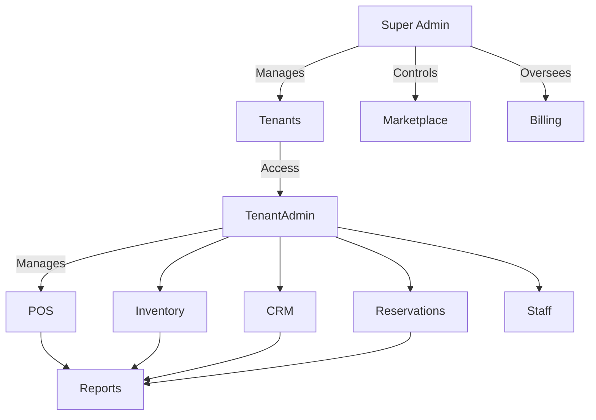

# Admin Panel Documentation

## Overview
- TBD

## Prerequisites
- TBD

## Setup
- TBD

## Usage
- TBD

## References
- TBD

## Overview
The Admin Panel provides centralized management for both **Super Admins** (platform-level) and **Tenant Admins** (business-level).

---

## Super Admin Panel
### Dashboards
- **System Health** → server status, queue backlog, error logs.
- **Tenant Management** → list tenants, enable/disable modules, monitor usage.
- **Billing Overview** → subscriptions, revenue reports, unpaid invoices.
- **Marketplace** → vendor plugins, approval queue, revenue share reports.

### Features
- Create/Deactivate tenants.
- Enable/disable modules per tenant.
- Manage global branding, themes, and default settings.
- Access system-wide audit logs.

---

## Tenant Admin Panel
### Dashboards
- **POS Overview** → sales summary, top products, active orders.
- **Inventory** → stock levels, low stock alerts, wastage reports.
- **CRM** → loyalty stats, customer segmentation, coupon usage.
- **Reservations** → bookings, cancellations, upcoming schedule.
- **Staff Management** → roles, permissions, shift scheduling.

### Features
- Assign roles (manager, cashier, waiter, chef).
- Configure tenant-specific branding (logo, theme colors).
- Manage billing for their subscription plan.
- Generate tenant-specific reports.

---

## Permissions Matrix
| Role       | POS | Inventory | CRM | Reservations | Billing | Marketplace | Admin Settings |
|------------|-----|-----------|-----|--------------|---------|-------------|----------------|
| Owner      | Full | Full      | Full| Full         | Full    | Full        | Full           |
| Manager    | Full | Full      | Full| Full         | Limited | Limited     | Limited        |
| Cashier    | Orders| View     | Limited| View      | None    | None        | None           |
| Waiter     | Orders| None     | View | View        | None    | None        | None           |
| Chef       | View Orders| None | None | None       | None    | None        | None           |

---

## Admin Panel Flow

---

## Security
- Two-factor authentication for all admins.
- Audit logs for critical actions (billing, module changes).
- RBAC enforced at both system and tenant level.
