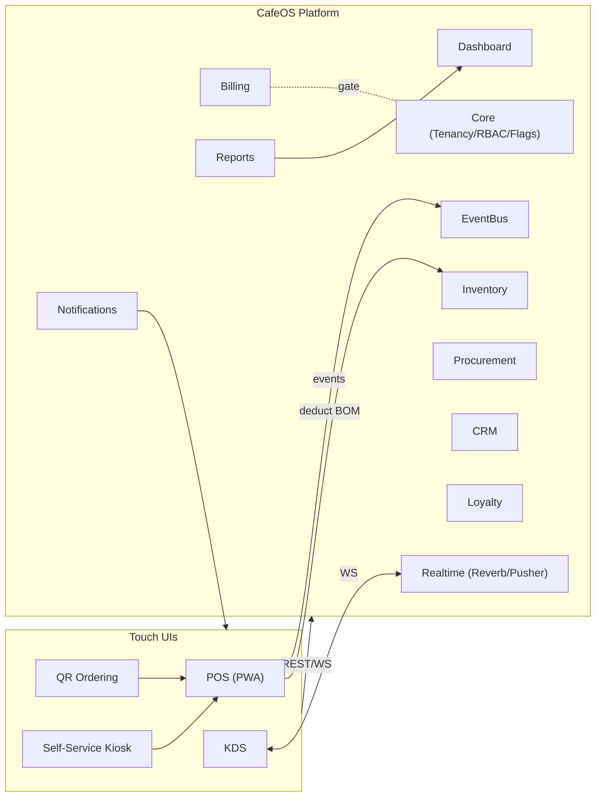
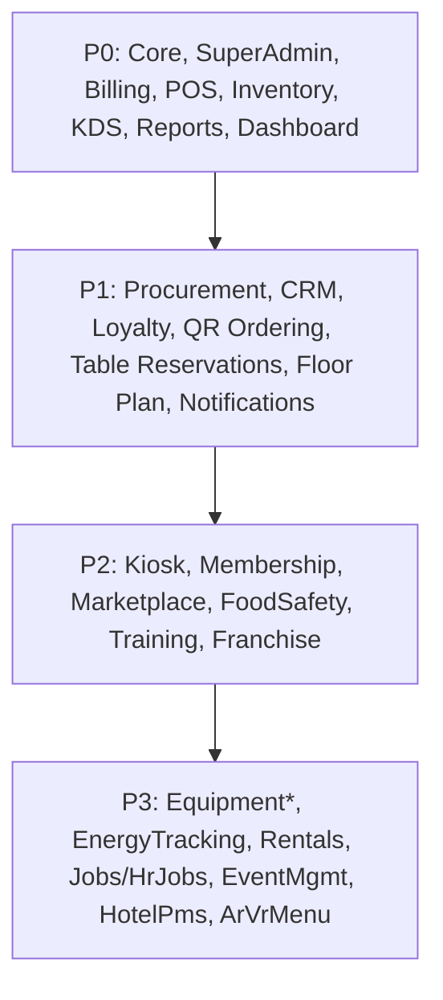
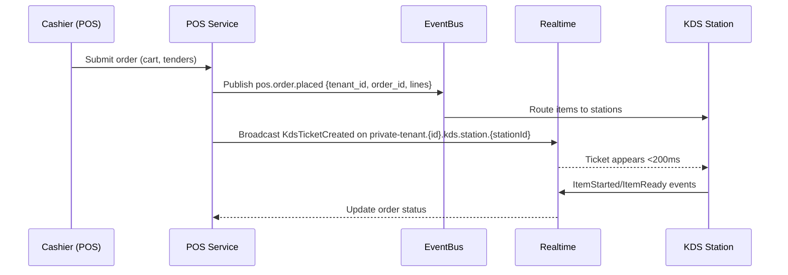
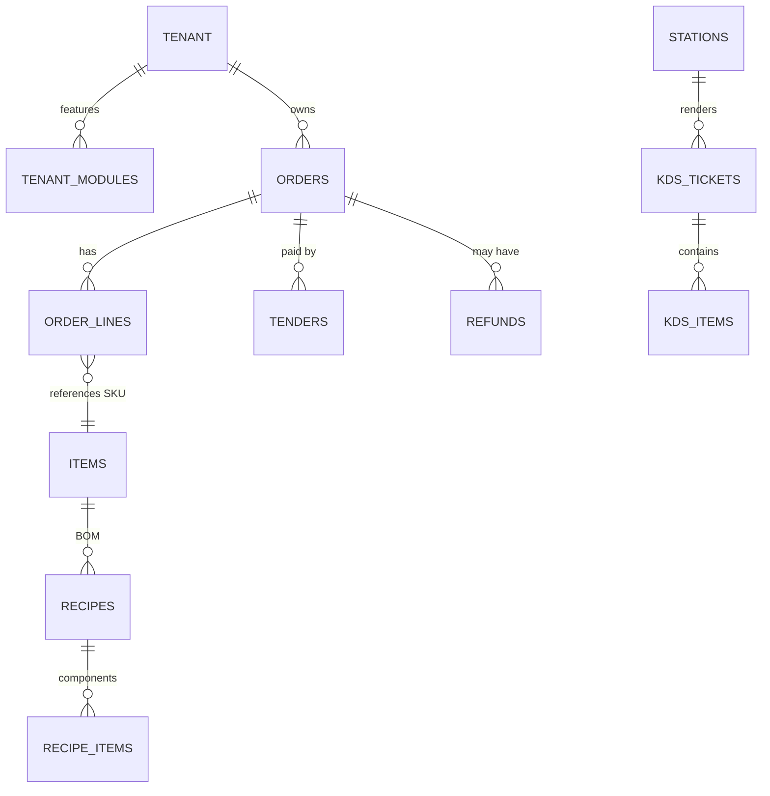
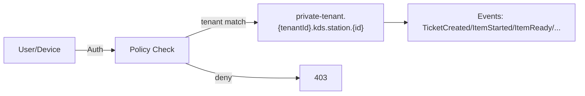

# AGENTS_ELITE (EN) — Advanced Module Guide for **CafeOS**
**Purpose:** A production‑grade, implementation‑ready reference that surpasses the previous spec in clarity, operability, quality bars, and growth readiness—without dates.

---

## 1) Design Tenets
- **Tenant‑First by Contract:** Every entity/event/channel/API explicitly carries `tenant_id`. No exceptions.
- **Modular Monolith + Feature Flags:** Per‑tenant enable/disable, module versioning, managed migrations.
- **Event‑Driven Core:** Publish/consume domain events through an **EventBus** (Outbox/Inbox, idempotency).
- **Realtime as a Primitive:** Private channels per `tenant_id` with strict policies.
- **Offline‑First for Touch UIs:** POS/KDS/QR/Kiosk run without network; reliable sync on return.
- **Observability by Default:** Tracing, metrics, structured logs, and a first‑class System Health page.
- **Security Hardening:** MFA, password policy, security headers, webhook signing, least‑privilege access.

---

## 2) Capability Map
**Core Platform:** Core, SuperAdmin, Billing, FeatureFlags, EventBus, Realtime, Device/Print, Observability, i18n/RTL.  
**Sales Channel:** POS, KDS, QR Ordering, Self‑Service Kiosk, Table Reservations, Floor Plan Designer.  
**Supply Chain:** Inventory, Procurement.  
**Customer & Revenue:** CRM, Loyalty, Membership, Notifications.  
**Governance & Analytics:** Reports, Dashboard, Franchise.  
**Vertical Expansion/Markets:** Marketplace, FoodSafety, Training, Equipment*, EnergyTracking, Rentals, Jobs/HrJobs, EventManagement, HotelPms, ArVrMenu.

> Golden rule: No production module without **Policies, Feature Flag, Events, i18n, Tests, Docs**.

---

## 3) Non‑Negotiables (Operational SLAs)
- **Performance:** Add‑to‑cart ≤ 50ms, KDS propagation < 200ms, checkout ≤ 2s, dashboard queries ≤ 1s (cached).
- **Availability:** Customer‑facing SLO ≥ 99.9; WS reconnect ≤ 5s.
- **Safety:** Risky actions require **Manager PIN** + append‑only audit.
- **Privacy:** Per‑tenant export/delete; sensitive data anonymized in backups.
- **Scalability:** New tables default to indexes on `(tenant_id, status, created_at)`.
- **Release Hygiene:** Reversible migrations and toggles before exposure.

---

## 4) Contracts & Conventions
### 4.1 REST
- Base: `api/v1/<module>/<resource>`; scoped by tenant via subdomain or `X‑Tenant‑ID`.
- Sorting/paging/filtering: `?filter[field]=…&sort=-created_at&cursor=…&limit=…`.
- Control: `Idempotency-Key`, `If-None-Match`, standard status codes.

### 4.2 Domain Events
- Name: `context.entity.action[.qualifier]` — e.g., `pos.order.placed`, `kds.item.ready`, `billing.subscription.updated`.
- Payload:
```json
{
  "id": "evt_...",
  "tenant_id": "t_...",
  "occurred_at": "ISO8601",
  "schema": "pos.order.placed/1",
  "data": { "order_id": "ord_...", "total": 123.45, "lines": [] },
  "meta": { "source": "pos", "trace_id": "..." }
}
```
- Guarantees: Outbox → Queue → Consumer; idempotency via `event.id`; exponential backoff.

### 4.3 Realtime Channels
- `private-tenant.{tenantId}.<context>.<entity>[.{id}]`  
- Policies: user/device belongs to tenant and has explicit permission on the resource.

### 4.4 Feature Flags
- `tenant_modules(module, enabled, version, constraints)`; constraints may include seats/locations/orders caps.

### 4.5 Access Policies
- Spatie Policies per model; Manager PIN for escalations with reason + signature.

---

## 5) Shared Operational Agents
- **FeatureFlags Agent:** Cached `tenant_modules`; `features()->enabled('kds')` helpers; plan constraint checks.
- **EventBus Agent:** Event contracts, retries, dead‑letter queue.
- **Realtime Agent:** Channels & policies; metrics (connections/events/min/latency).
- **Print/Device Agent:** ESC/POS bridge, provisioning, heartbeats, kiosk lock.
- **PWA/Offline Agent:** Service worker, IndexedDB, sync queue, conflict resolution.
- **Observability Agent:** Sentry/Tracing, metrics, alerts, System Health page.
- **Security Agent:** MFA, webhook signing, secrets rotation, password rules.
- **i18n Agent:** Keys management, RTL, JSON import/export, full coverage.

---

## 6) Launch Priorities (Module Waves)
- **P0:** Core, SuperAdmin, Billing, POS, Inventory, KDS, Reports, Dashboard  
- **P1:** Procurement, CRM, Loyalty, QR Ordering, Table Reservations, Floor Plan Designer, Notifications  
- **P2:** Self‑Service Kiosk, Membership, Marketplace, FoodSafety, Training, Franchise  
- **P3:** EquipmentMonitoring, EquipmentMaintenance, EnergyTracking, EquipmentLeasing, Rentals, Jobs/HrJobs, EventManagement, HotelPms, ArVrMenu

> P0 unlocks revenue and stabilizes ops. P1 grows retention & ARPU. P2/P3 open new markets.

---

## 7) Module Specifications (Concise)

### 7.1 Core
**Role:** Tenancy isolation, RBAC, feature flags, event bus, system health.  
**Tables:** `tenants`, `tenant_modules`, `roles`, `permissions`, `audit_logs`.  
**Events:** `core.tenant.created`, `core.module.toggled`.  
**AC:** All queries tenant‑scoped; health shows DB/Queue/WS/Scheduler status.

### 7.2 SuperAdmin
**Role:** Per‑tenant module lifecycle, impersonation, usage observability.  
**AC:** Toggle reflects in UI/API immediately via FeatureFlags; audited.

### 7.3 Billing
**Role:** Subscriptions, plans, webhooks, dunning/proration, customer portal.  
**Tables:** `subscriptions`, `invoices`, `payments`, `usage_meter`.  
**AC:** Plan changes gate features instantly; signed PDFs; payment failures surfaced.

### 7.4 POS
**Role:** Fast checkout, multi‑tender, taxes/service/fees, discounts, printing, shifts, refunds, offline.  
**Tables:** `orders`, `order_lines`, `tenders`, `discounts`, `taxes`, `service_charges`, `shifts`, `cash_movements`, `devices`, `printers`.  
**Events:** `pos.order.placed`, `pos.order.refunded`, `pos.shift.closed`.  
**AC:** Cash‑only during outage with later sync (no duplicates); print < 1s; PIN‑guarded overrides.

### 7.5 Inventory
**Role:** UOM/conversions, recipes/BOM, auto‑deduct, COGS, transfers, stocktake, waste, 86‑list.  
**AC:** Sale deducts components precisely; min‑stock alerts; trustworthy COGS.

### 7.6 KDS
**Role:** Stations/routing, item states, Expo, SLA & colors, realtime, resync.  
**Tables:** `stations`, `station_routes`, `kds_tickets`, `kds_items`, `devices`.  
**AC:** Item fired visible at station < 200ms; Expo blocks incomplete serve; safe resync.

### 7.7 Reports
**Role:** Day sales, X/Z, Top SKUs, discounts/void; CSV/PDF; schedulers.  
**AC:** Fast reads (pre‑aggregations) with drill‑downs.

### 7.8 Dashboard
**Role:** Executive KPIs + System Health + quick actions; sub‑second load (cached).

### 7.9 Procurement
**Role:** RFQ→PO→GRN/Invoice, approvals, supplier prices, 3‑way match with tolerances.  
**AC:** GRN updates stock and partially closes POs correctly.

### 7.10 CRM
**Role:** Unified customer profile, segments/cohorts, consent, comms history.

### 7.11 Loyalty
**Role:** Earn/redeem rules, ledger, expiry, limits/fraud, POS hooks.

### 7.12 QR Ordering
**Role:** Table/zone mapping, anti‑spoofing, menu/modifiers, checkout, notifications.

### 7.13 Table Reservations
**Role:** Slots/capacity, holds/deposits, waitlist + SMS; open a POS tab on seat.

### 7.14 Floor Plan Designer
**Role:** Drag‑and‑drop floors/zones; POS seating sync.

### 7.15 Notifications
**Role:** Templates, preferences, multi‑channel delivery, logs/retries, webhooks.

### 7.16+ (P2/P3)
**Self‑Service Kiosk, Membership, Marketplace, FoodSafety, Training, Franchise, Equipment*, EnergyTracking, Rentals, Jobs/HrJobs, EventManagement, HotelPms, ArVrMenu** follow the same spec pattern with their dependencies.

---

## 8) Definition of Ready / Done
**DoR:** API/events design, DB schema, policies, feature flag, i18n keys, test plan, perf/security impact.  
**DoD:** Code + green tests, docs, UI snapshots as needed, i18n/RTL verified, zero critical static analysis issues.

---

## 9) Testing & Resilience
- **Pyramid:** Unit > Feature > E2E (Playwright/Cypress).  
- **Performance:** k6 for throughput/latency for hot paths.  
- **WS/Offline:** Network cut/recovery scenarios; events sequencing.  
- **Contract Tests:** Webhooks/events (producer ↔ consumer).

---

## 10) Security & Compliance
- MFA, password policy, session lock, API scopes, webhook signing.  
- Strict security headers; rate limits; secrets outside `.env`.  
- Data privacy: per‑tenant export/delete; cookie consent.  
- (Optional) Fiscalization: QR/sequence/digital signing per country.

---

## 11) New Module — Practical Checklist
1) `module.json`, ServiceProvider, routes (web/api), models (inherit TenantModel), migrations (`tenant_id`), policies, resources (Filament/Pages), lang (ar/en).  
2) Feature flag + plan constraints.  
3) Events + consumers + Outbox.  
4) Standard indexes, tests, concise docs, UI screenshots.  
5) Basic KPIs for the module.

---

## 12) Mermaid Diagrams

### 12.1 System Architecture (high‑level)


### 12.2 Module Launch Priorities


### 12.3 POS → KDS Realtime Sequence


### 12.4 Data Model Highlights (ER)


### 12.5 Realtime Channels & Policies


---

**Bottom line:** This guide is immediately actionable. Use it as the contract between product, engineering, and ops—so each module ships production‑ready and revenue‑generating.
