# Modules (Agents) Documentation

## Core & Governance
### Core
- Multi-tenancy, RBAC, EventBus.  

### Super Admin
- Manage tenants, billing, branding.  

### Billing
- Stripe/Paddle integration.  

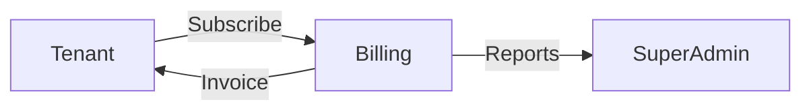

## Hospitality Ops
### POS
- Orders, payments, receipts.  

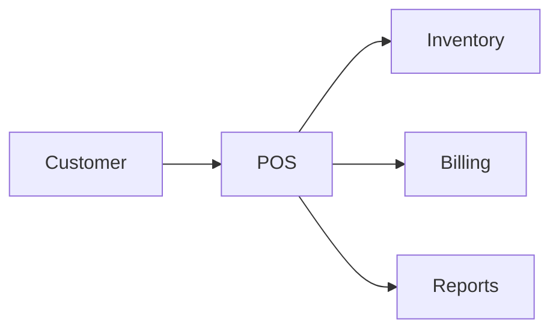

### Inventory
- Stock levels, expiry, auditing.  

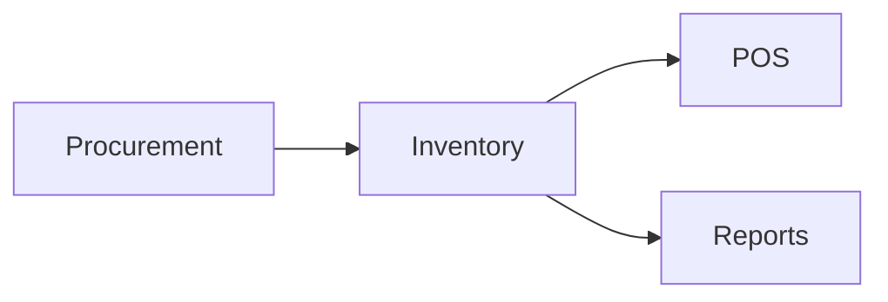

### KDS
- Kitchen display system.  

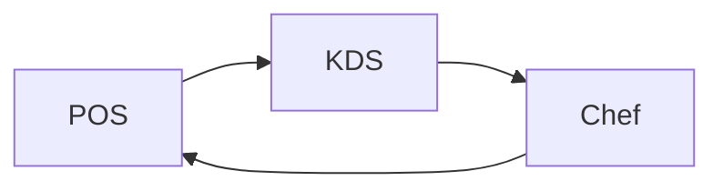

### Procurement
- Supplier management, stock transfers.  

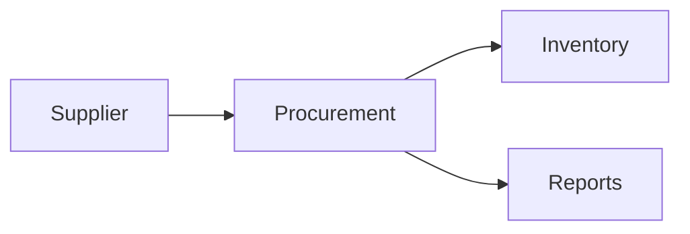

### CRM
- Customers, loyalty, coupons.  

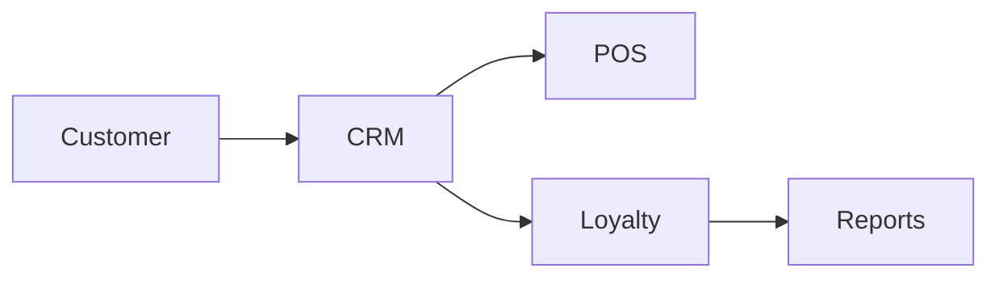

### Reservations
- Table booking system.  

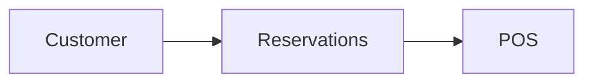

### Franchise
- Manage multi-branch operations.  

### Food Safety
- HACCP, compliance logs.  

## Extensions
### Marketplace
- Vendors, integrations, plugin system.  

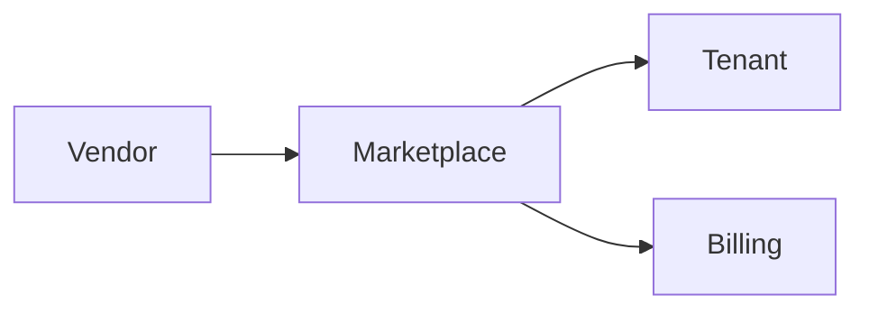

### Jobs
- Recruitment, employee applications.  

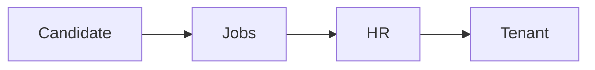

### Rentals
- Restaurant/cafe rentals or sales.  

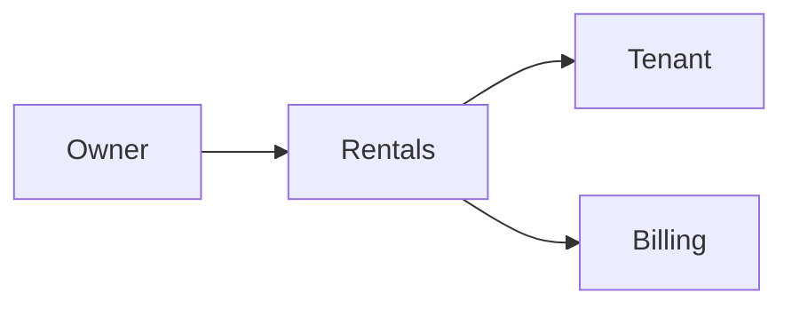

### Training
- Staff training and evaluation.  

### Energy Tracking
- Monitor electricity/water usage.  

### Equipment
- Maintenance tracking.  

### AR/VR Menu
- Immersive menu experience.  

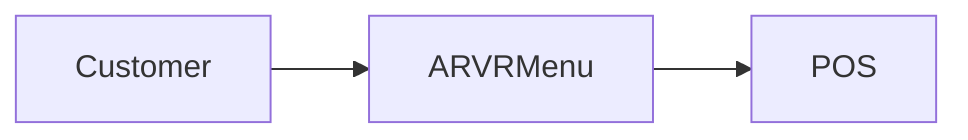

