<!-- START doctoc generated TOC please keep comment here to allow auto update -->
<!-- DON'T EDIT THIS SECTION, INSTEAD RE-RUN doctoc TO UPDATE -->
## Table of Contents

- [Modules (Agents) Documentation](#modules-agents-documentation)
  - [Overview](#overview)
  - [Prerequisites](#prerequisites)
  - [Setup](#setup)
  - [Usage](#usage)
  - [References](#references)
  - [Core & Governance](#core--governance)
    - [Core](#core)
    - [Super Admin](#super-admin)
    - [Billing](#billing)
  - [Hospitality Ops](#hospitality-ops)
    - [POS](#pos)
    - [Inventory](#inventory)
    - [KDS](#kds)
    - [Procurement](#procurement)
    - [CRM](#crm)
    - [Reservations](#reservations)
    - [Franchise](#franchise)
    - [Food Safety](#food-safety)
  - [Extensions](#extensions)
    - [Marketplace](#marketplace)
    - [Jobs](#jobs)
    - [Rentals](#rentals)
    - [Training](#training)
    - [Energy Tracking](#energy-tracking)
    - [Equipment](#equipment)
    - [AR/VR Menu](#arvr-menu)

<!-- END doctoc generated TOC please keep comment here to allow auto update -->

# Modules (Agents) Documentation

## Overview
- This section outlines the primary goals and scope of Agents.

## Prerequisites
- Familiarity with basic Agents concepts and system requirements is recommended.

## Setup
- Follow these steps to configure and enable Agents in your environment.

## Usage
- Instructions and examples for applying Agents in day-to-day operations.

## References
- Additional resources and documentation about Agents for further learning.

## Core & Governance
### Core
- Multi-tenancy, RBAC, EventBus.  

### Super Admin
- Manage tenants, billing, branding.  

### Billing
- Stripe/Paddle integration.  

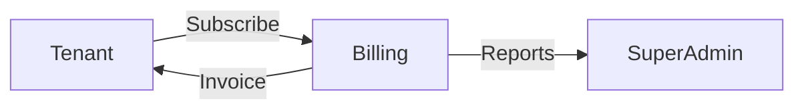

## Hospitality Ops
### POS
- Orders, payments, receipts.  

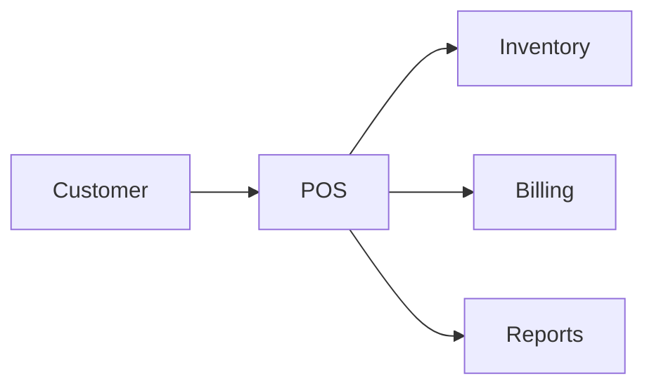

### Inventory
- Stock levels, expiry, auditing.  

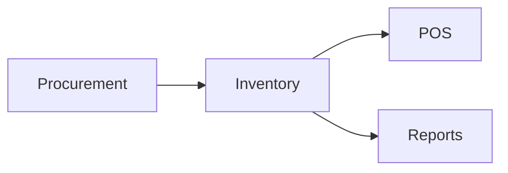

### KDS
- Kitchen display system.  

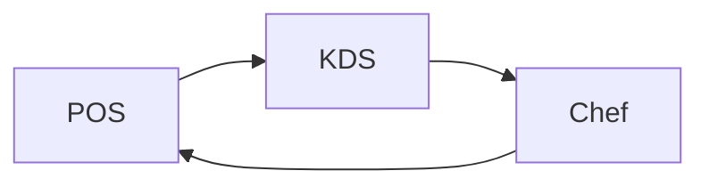

### Procurement
- Supplier management, stock transfers.  

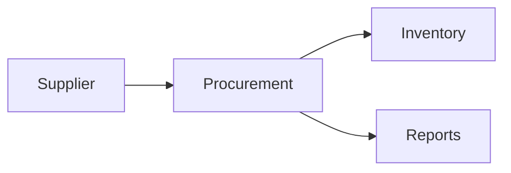

### CRM
- Customers, loyalty, coupons.  

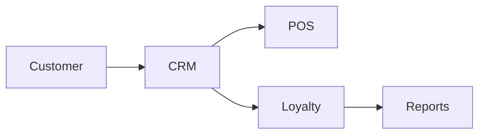

### Reservations
- Table booking system.  

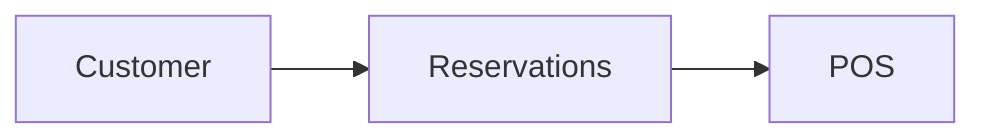

### Franchise
- Manage multi-branch operations.  

### Food Safety
- HACCP, compliance logs.  

## Extensions
### Marketplace
- Vendors, integrations, plugin system.  

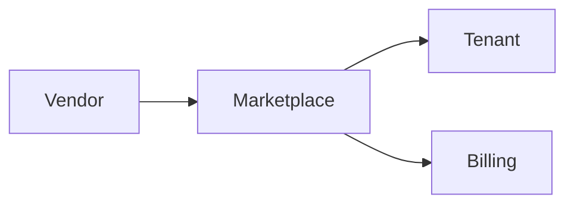

### Jobs
- Recruitment, employee applications.  

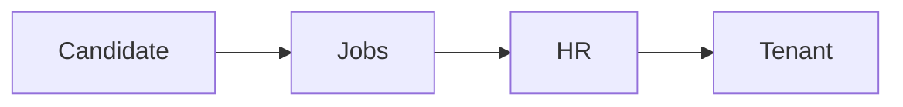

### Rentals
- Restaurant/cafe rentals or sales.  

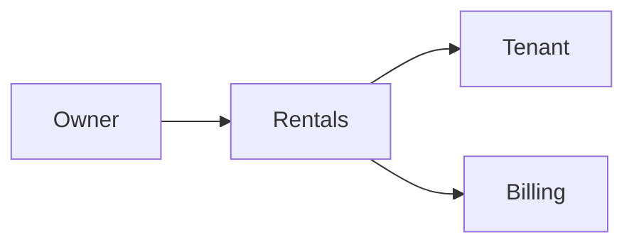

### Training
- Staff training and evaluation.  

### Energy Tracking
- Monitor electricity/water usage.  

### Equipment
- Maintenance tracking.  

### AR/VR Menu
- Immersive menu experience.  

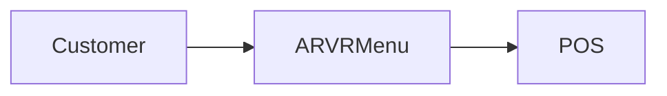

