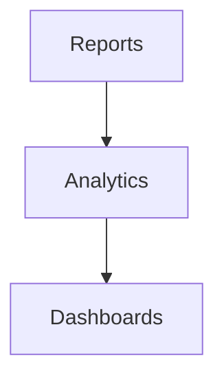

# Analytics Module

## Overview
- This section outlines the primary goals and scope of Analytics.

## Prerequisites
- Familiarity with basic Analytics concepts and system requirements is recommended.

## Setup
- Follow these steps to configure and enable Analytics in your environment.

## Usage
- Instructions and examples for applying Analytics in day-to-day operations.

## References
- Additional resources and documentation about Analytics for further learning.

## Overview
Provides business intelligence dashboards for tenants.

## Features
- Sales trends
- Customer segmentation
- Forecasting (AI-ready)
- Drill-down dashboards

## Flow

## Related Docs
- [README.md](README.md)
- [MASTER_INDEX.md](MASTER_INDEX.md)

## Changelog
- Added Last Updated metadata

Last Updated: 2025-09-11 by ChatGPT
