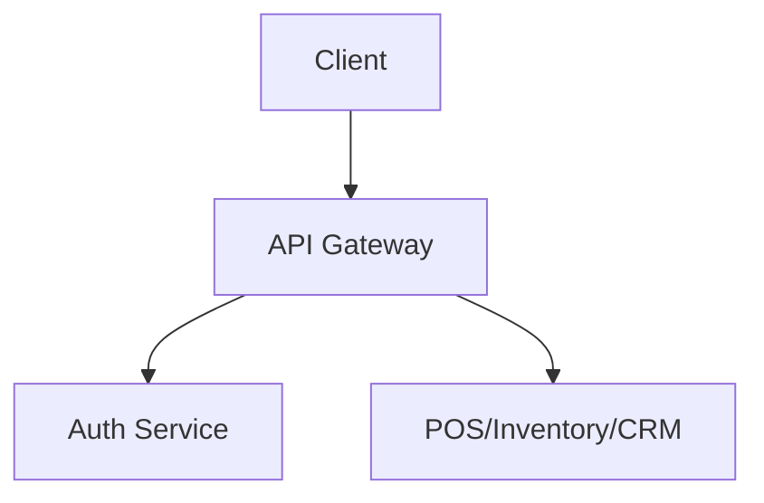

# API Gateway

## Overview
Protects and manages external API traffic.

## Features
- Rate limiting per tenant.
- API keys & secrets.
- Request/response logging.
- CORS management.

## Flow

```mermaid
flowchart TD
    Client --> Gateway[API Gateway]
    Gateway --> Auth[Auth Service]
    Gateway --> Services[POS/Inventory/CRM]
```
