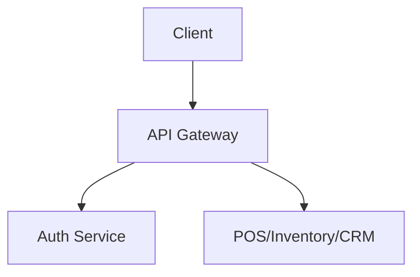

<!-- START doctoc generated TOC please keep comment here to allow auto update -->
<!-- DON'T EDIT THIS SECTION, INSTEAD RE-RUN doctoc TO UPDATE -->
## Table of Contents

- [API Gateway](#api-gateway)
  - [Overview](#overview)
  - [Prerequisites](#prerequisites)
  - [Setup](#setup)
  - [Usage](#usage)
  - [References](#references)
  - [Related Docs](#related-docs)

<!-- END doctoc generated TOC please keep comment here to allow auto update -->

# API Gateway

## Overview
- This section outlines the primary goals and scope of Api Gateway.
- Protects and manages external API traffic.
- Features include rate limiting per tenant, API keys & secrets, request/response logging, and CORS management.

## Prerequisites
- Familiarity with basic Api Gateway concepts and system requirements is recommended.

## Setup
- Follow these steps to configure and enable Api Gateway in your environment.

## Usage
- Instructions and examples for applying Api Gateway in day-to-day operations.

The diagram below illustrates how requests flow through the API Gateway.

## References
- Additional resources and documentation about Api Gateway for further learning.

## Related Docs
- [README.md](README.md)
- [MASTER_INDEX.md](MASTER_INDEX.md)

