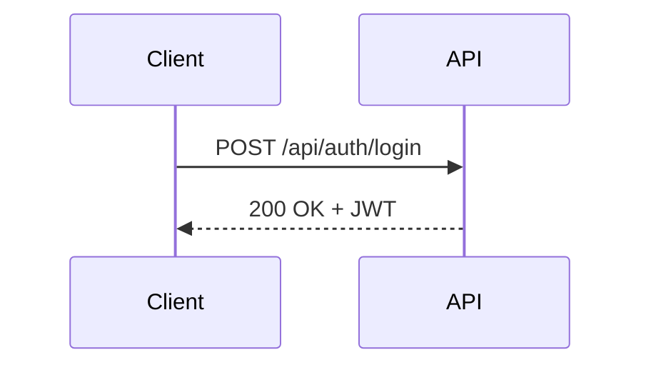
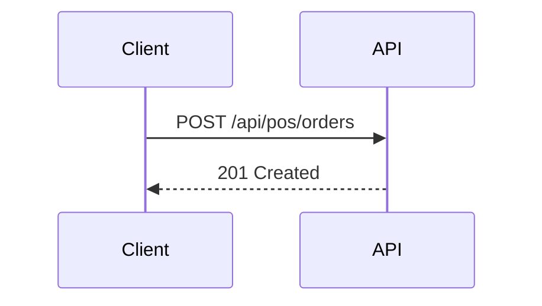

<!-- START doctoc generated TOC please keep comment here to allow auto update -->
<!-- DON'T EDIT THIS SECTION, INSTEAD RE-RUN doctoc TO UPDATE -->
## Table of Contents

- [API Reference](#api-reference)
  - [Authentication](#authentication)
    - [POST /api/auth/login](#post-apiauthlogin)
    - [POST /api/auth/register](#post-apiauthregister)
    - [POST /api/auth/logout](#post-apiauthlogout)
  - [POS](#pos)
    - [POST /api/pos/orders](#post-apiposorders)
    - [GET /api/pos/orders/{id}](#get-apiposordersid)
  - [Inventory](#inventory)
    - [GET /api/inventory/items](#get-apiinventoryitems)
    - [POST /api/inventory/adjust](#post-apiinventoryadjust)
  - [Billing](#billing)
    - [POST /api/billing/subscribe](#post-apibillingsubscribe)
    - [GET /api/billing/invoices](#get-apibillinginvoices)
  - [Marketplace](#marketplace)
    - [GET /api/marketplace/vendors](#get-apimarketplacevendors)
    - [POST /api/marketplace/plugins/install](#post-apimarketplacepluginsinstall)
  - [Error Codes](#error-codes)
  - [Related Docs](#related-docs)

<!-- END doctoc generated TOC please keep comment here to allow auto update -->

# API Reference

This document describes core API endpoints. For a full specification, see `openapi.yaml` or Postman collection.

## Authentication

### POST /api/auth/login
**Method:** `POST`  
**Path:** `/api/auth/login`  
**Auth:** None  
**Fields:**
- `email` (string) – user email.
- `password` (string) – user password.

**Request**
```json
{
  "email": "user@example.com",
  "password": "secret"
}
```

**Response**
```json
{
  "token": "jwt-token"
}
```

**Errors**
- `400` Invalid request data.
- `401` Invalid credentials.



### POST /api/auth/register
**Method:** `POST`  
**Path:** `/api/auth/register`  
**Auth:** None  
**Fields:**
- `name` (string)
- `email` (string)
- `password` (string)

**Request**
```json
{
  "name": "Demo User",
  "email": "user@example.com",
  "password": "secret"
}
```

**Response**
```json
{
  "id": 10,
  "name": "Demo User"
}
```

**Errors**
- `400` Invalid data.

### POST /api/auth/logout
**Method:** `POST`  
**Path:** `/api/auth/logout`  
**Auth:** JWT Bearer  
**Fields:** None

**Response**
```
204 No Content
```

**Errors**
- `401` Unauthorized.

## POS

### POST /api/pos/orders
**Method:** `POST`  
**Path:** `/api/pos/orders`  
**Auth:** JWT Bearer  
**Fields:**
- `items` (array) – objects with `id` and `qty`.
- `total` (number)

**Request**
```json
{
  "items": [{ "id": 1, "qty": 2 }],
  "total": 25.5
}
```

**Response**
```json
{
  "id": 123,
  "status": "created"
}
```

**Errors**
- `400` Invalid payload.
- `401` Unauthorized.



### GET /api/pos/orders/{id}
**Method:** `GET`  
**Path:** `/api/pos/orders/{id}`  
**Auth:** JWT Bearer  
**Fields:** Path `id` (integer)

**Response**
```json
{
  "id": 123,
  "total": 25.5,
  "items": [{ "id": 1, "qty": 2 }]
}
```

**Errors**
- `401` Unauthorized.
- `404` Not found.

## Inventory

### GET /api/inventory/items
**Method:** `GET`  
**Path:** `/api/inventory/items`  
**Auth:** JWT Bearer  
**Fields:** None

**Response**
```json
{
  "items": [{ "id": 1, "name": "Milk", "qty": 10 }]
}
```

**Errors**
- `401` Unauthorized.

### POST /api/inventory/adjust
**Method:** `POST`  
**Path:** `/api/inventory/adjust`  
**Auth:** JWT Bearer  
**Fields:**
- `item_id` (integer)
- `delta` (integer)

**Request**
```json
{
  "item_id": 1,
  "delta": -2
}
```

**Response**
```json
{ "status": "ok" }
```

**Errors**
- `400` Invalid request.
- `401` Unauthorized.

## Billing

### POST /api/billing/subscribe
**Method:** `POST`  
**Path:** `/api/billing/subscribe`  
**Auth:** JWT Bearer  
**Fields:** `plan_id` (string)

**Request**
```json
{
  "plan_id": "basic"
}
```

**Response**
```json
{ "status": "active" }
```

**Errors**
- `400` Invalid plan.
- `401` Unauthorized.

### GET /api/billing/invoices
**Method:** `GET`  
**Path:** `/api/billing/invoices`  
**Auth:** JWT Bearer  
**Fields:** None

**Response**
```json
{
  "invoices": [{ "id": "inv_001", "total": 99.0 }]
}
```

**Errors**
- `401` Unauthorized.

## Marketplace

### GET /api/marketplace/vendors
**Method:** `GET`  
**Path:** `/api/marketplace/vendors`  
**Auth:** JWT Bearer  
**Fields:** None

**Response**
```json
{
  "vendors": [{ "id": "vend_1", "name": "CoffeeBeans Inc" }]
}
```

**Errors**
- `401` Unauthorized.

### POST /api/marketplace/plugins/install
**Method:** `POST`  
**Path:** `/api/marketplace/plugins/install`  
**Auth:** OAuth2 (client credentials)  
**Fields:** `plugin_id` (string)

**Request**
```json
{
  "plugin_id": "analytics"
}
```

**Response**
```json
{ "status": "installed" }
```

**Errors**
- `400` Invalid plugin.
- `401` Unauthorized.

## Error Codes
- **400** Bad Request → Invalid input.
- **401** Unauthorized → Missing/invalid token.
- **403** Forbidden → No permission.
- **404** Not Found → Resource missing.
- **500** Internal Server Error → Unexpected issue.

## Related Docs
- [README.md](README.md)
- [MASTER_INDEX.md](MASTER_INDEX.md)


## Changelog
- Added Last Updated metadata

Last Updated: 2025-09-11 by ChatGPT
