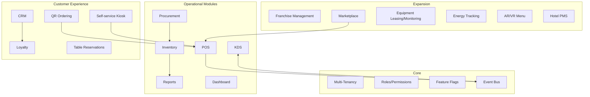

# Architecture Overview

```mermaid
flowchart TD
  subgraph Core
    Tenancy[Multi-Tenancy]
    RBAC[Roles/Permissions]
    Flags[Feature Flags]
    EventBus[Event Bus]
  end

  subgraph Ops[Operational Modules]
    POS[POS]
    KDS[KDS]
    Inventory[Inventory]
    Procurement[Procurement]
    Reports[Reports]
    Dashboard[Dashboard]
  end

  subgraph CX[Customer Experience]
    CRM[CRM]
    Loyalty[Loyalty]
    QR[QR Ordering]
    Reservations[Table Reservations]
    Kiosk[Self-service Kiosk]
  end

  subgraph Expansion
    Franchise[Franchise Management]
    Marketplace[Marketplace]
    Equipment[Equipment Leasing/Monitoring]
    Energy[Energy Tracking]
    ArVr[AR/VR Menu]
    PMS[Hotel PMS]
  end

  POS --> EventBus
  KDS <--> EventBus
  Inventory --> Reports
  Procurement --> Inventory
  CRM --> Loyalty
  QR --> POS
  Kiosk --> POS
  Marketplace --> POS
```
