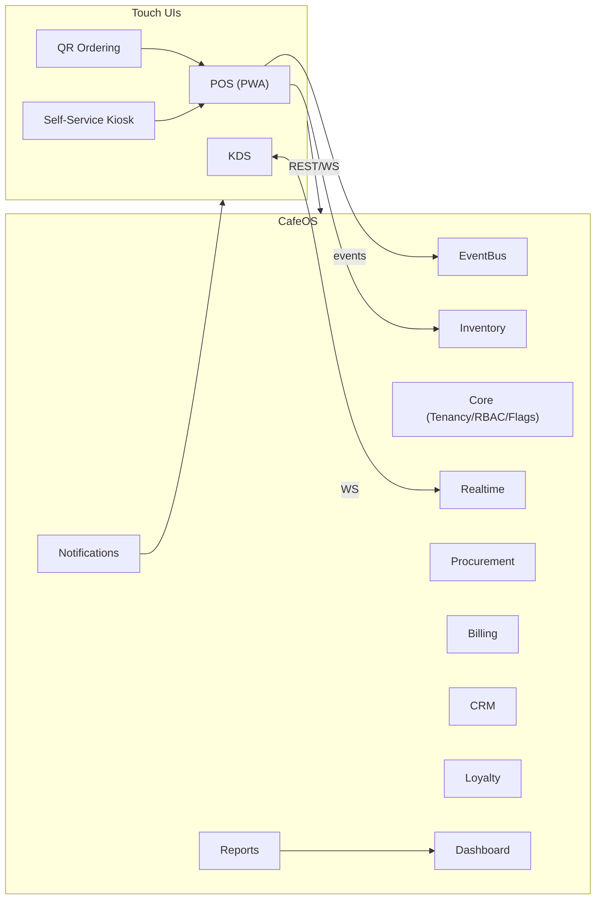

# Architecture — High‑level Overview

```mermaid
flowchart LR
  subgraph Client["Touch UIs"]
    POS["POS (PWA)"]
    KDS["KDS"]
    QR["QR Ordering"]
    Kiosk["Self‑Service Kiosk"]
  end

  subgraph Platform["CafeOS"]
    Core["Core (Tenancy/RBAC/Flags)"]
    Bus["EventBus"]
    RT["Realtime"]
    Inv["Inventory"]
    Proc["Procurement"]
    Bill["Billing"]
    CRM["CRM"]
    Loy["Loyalty"]
    Noti["Notifications"]
    Rep["Reports"]
    Dash["Dashboard"]
  end

  Client -->|REST/WS| Platform
  POS -->|events| Bus
  POS --> Inv
  KDS <-->|WS| RT
  QR --> POS
  Kiosk --> POS
  Rep --> Dash
  Noti --> Client
```
