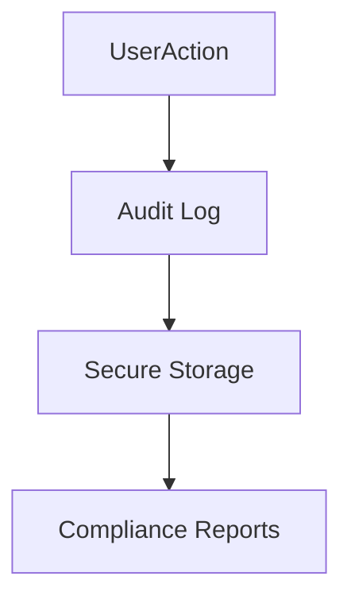

# Audit Logs

## Overview
Audit logging ensures accountability and compliance.

## Logged Actions
- Login/logout events.
- Data creation, updates, deletions.
- Billing actions (payments, refunds).
- Admin actions (role changes, module toggles).

## Storage
- Stored per tenant in append-only log.
- Tamper-proof with cryptographic hashing.

## Access
- Viewable by Tenant Admins (their own data).
- Super Admins can audit all tenants.

## Diagram

