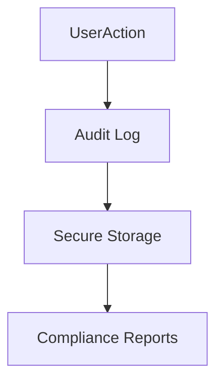

# Audit Logs

## Overview
- This section outlines the primary goals and scope of Audit Logs.

## Prerequisites
- Familiarity with basic Audit Logs concepts and system requirements is recommended.

## Setup
- Follow these steps to configure and enable Audit Logs in your environment.

## Usage
- Instructions and examples for applying Audit Logs in day-to-day operations.

## References
- Additional resources and documentation about Audit Logs for further learning.

## Overview
Audit logging ensures accountability and compliance.

## Logged Actions
- Login/logout events.
- Data creation, updates, deletions.
- Billing actions (payments, refunds).
- Admin actions (role changes, module toggles).

## Storage
- Stored per tenant in append-only log.
- Tamper-proof with cryptographic hashing.

## Access
- Viewable by Tenant Admins (their own data).
- Super Admins can audit all tenants.

## Diagram

## Related Docs
- [README.md](README.md)
- [MASTER_INDEX.md](MASTER_INDEX.md)

## Changelog
- Added Last Updated metadata

Last Updated: 2025-09-11 by ChatGPT
