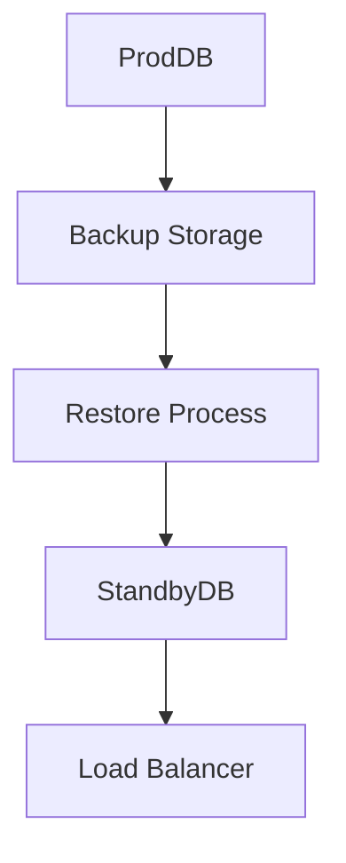

# Backup & Recovery

## Backup Strategy
- **Daily Incremental Backups** for DBs.
- **Weekly Full Backups** stored in cloud (S3).
- **Hourly Snapshots** for critical systems.

## Recovery Steps
1. Detect outage or data loss.
2. Identify last successful backup.
3. Restore backup to standby DB.
4. Sync incremental changes if possible.
5. Switch traffic via load balancer.

## Diagram


## Use Cases
- Guarding against accidental data deletion.
- Recovering from ransomware attacks.
- Meeting compliance requirements for data retention.

## Setup Steps
1. Configure the backup service with cloud storage credentials.
2. Schedule daily incremental and weekly full backups.
3. Test restore procedures on a staging environment.

## Example Configuration
```bash
# Trigger a manual full backup
backup-cli run --full --destination s3://cafeos-backups/prod
```

## Scenario
A primary database crashes. The operator restores the latest full backup to a standby instance, applies incremental logs, and then updates the load balancer to point traffic to the standby.
