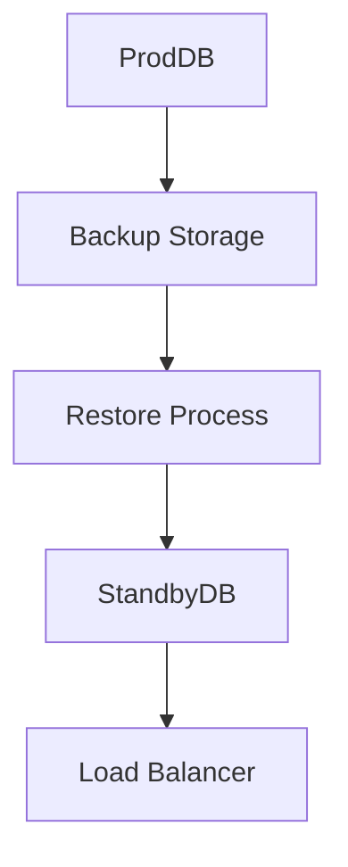

# Backup & Recovery

## Backup Strategy
- **Daily Incremental Backups** for DBs.
- **Weekly Full Backups** stored in cloud (S3).
- **Hourly Snapshots** for critical systems.

## Recovery Steps
1. Detect outage or data loss.
2. Identify last successful backup.
3. Restore backup to standby DB.
4. Sync incremental changes if possible.
5. Switch traffic via load balancer.

## Diagram

