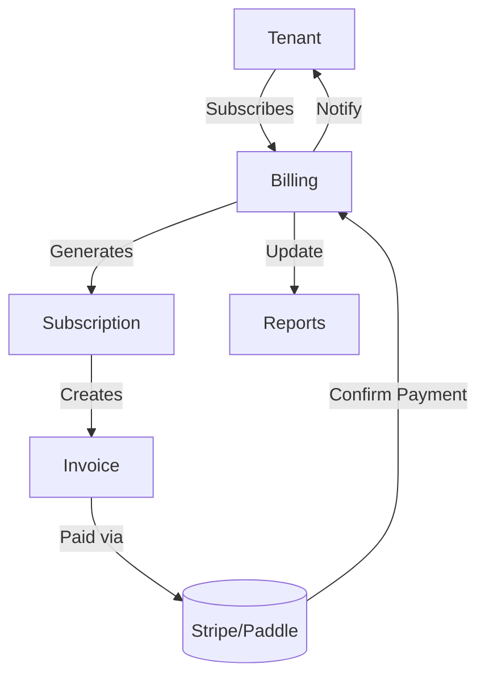

# Billing Module

## Overview
- TBD

## Prerequisites
- TBD

## Setup
- TBD

## Usage
- TBD

## References
- TBD

## Overview
Handles subscription management, invoicing, and payment processing for tenants.

## Features
- Stripe/Paddle integration for payments.  
- Subscription plans per tenant.  
- Automatic invoice generation.  
- Revenue sharing for Marketplace plugins.  

## Workflow

## API
- `POST /api/billing/subscribe` – Subscribe tenant to plan.  
- `GET /api/billing/invoices` – List invoices.  
- `POST /api/billing/pay` – Process payment.  

## Security
- Only tenant admins can manage subscriptions.  
- PCI DSS compliance for payment data.  

## Future Enhancements
- Multi-gateway fallback.  
- Support for crypto payments.  
