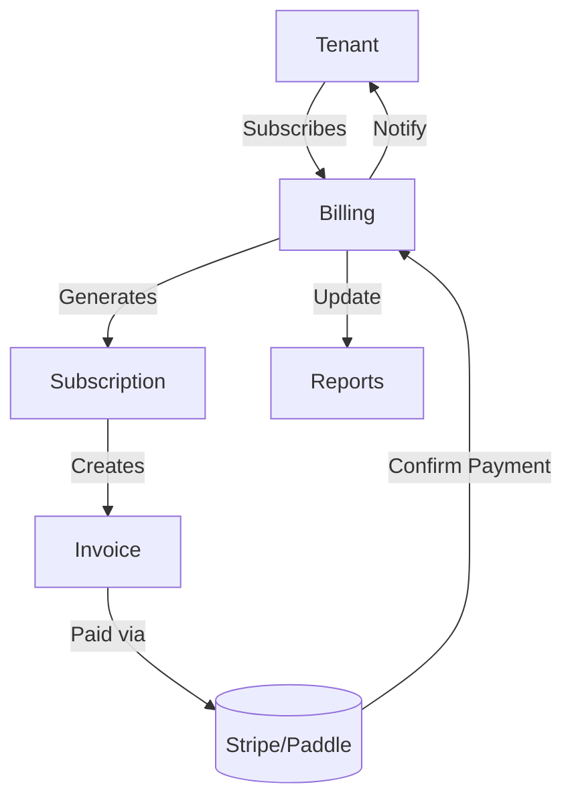

# Billing Module

## Overview
- This section outlines the primary goals and scope of Billing.

## Prerequisites
- Familiarity with basic Billing concepts and system requirements is recommended.

## Setup
- Follow these steps to configure and enable Billing in your environment.

## Usage
- Instructions and examples for applying Billing in day-to-day operations.

## References
- Additional resources and documentation about Billing for further learning.


## Overview
Handles subscription management, invoicing, and payment processing for tenants.

## Features
- Stripe/Paddle integration for payments.  
- Subscription plans per tenant.  
- Automatic invoice generation.  
- Revenue sharing for Marketplace plugins.  

## Workflow


## API
- `POST /api/billing/subscribe` – Subscribe tenant to plan.
- `GET /api/billing/invoices` – List invoices.
- `POST /api/billing/pay` – Process payment.

## Use Case
### Create a new invoice
```bash
curl -X POST https://api.example.com/billing/invoices \
  -H "Authorization: Bearer <token>" \
  -H "Content-Type: application/json" \
  -d '{"tenant_id":123,"amount":99.99,"description":"Monthly subscription"}'
```

## Security
- Only tenant admins can manage subscriptions.
- PCI DSS compliance for payment data.

## Future Enhancements
- Multi-gateway fallback.  
- Support for crypto payments.

## Related Docs
- [README.md](README.md)
- [MASTER_INDEX.md](MASTER_INDEX.md)

