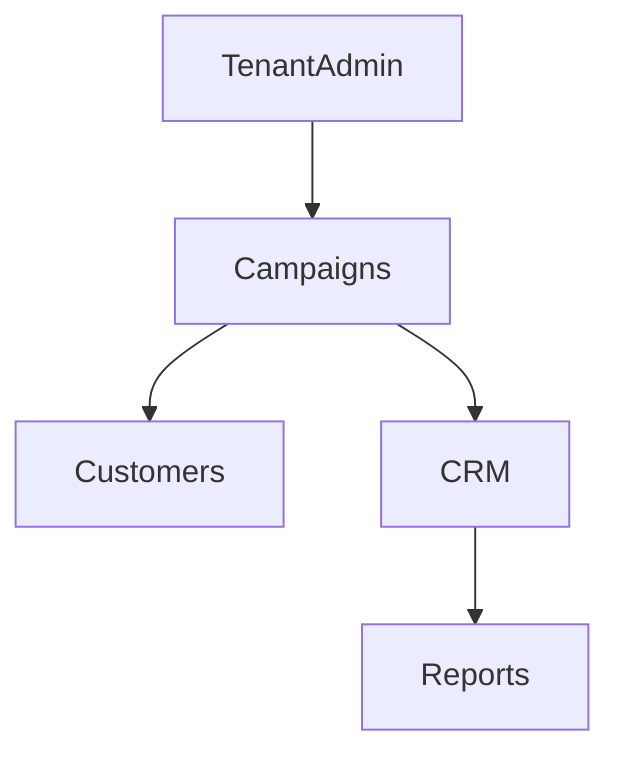

# Campaigns (CRM & Loyalty)

## Overview
- This section outlines the primary goals and scope of Campaigns.

## Prerequisites
- Familiarity with basic Campaigns concepts and system requirements is recommended.

## Setup
- Follow these steps to configure and enable Campaigns in your environment.

## Usage
- Instructions and examples for applying Campaigns in day-to-day operations.

## References
- Additional resources and documentation about Campaigns for further learning.

## Overview
Campaign engine for marketing & promotions.

## Features
- Seasonal discounts
- Loyalty multipliers (double points week)
- Targeted offers (customer segments)

## Flow

## Related Docs
- [README.md](README.md)
- [MASTER_INDEX.md](MASTER_INDEX.md)

## Changelog
- Added Last Updated metadata

Last Updated: 2025-09-11 by ChatGPT
