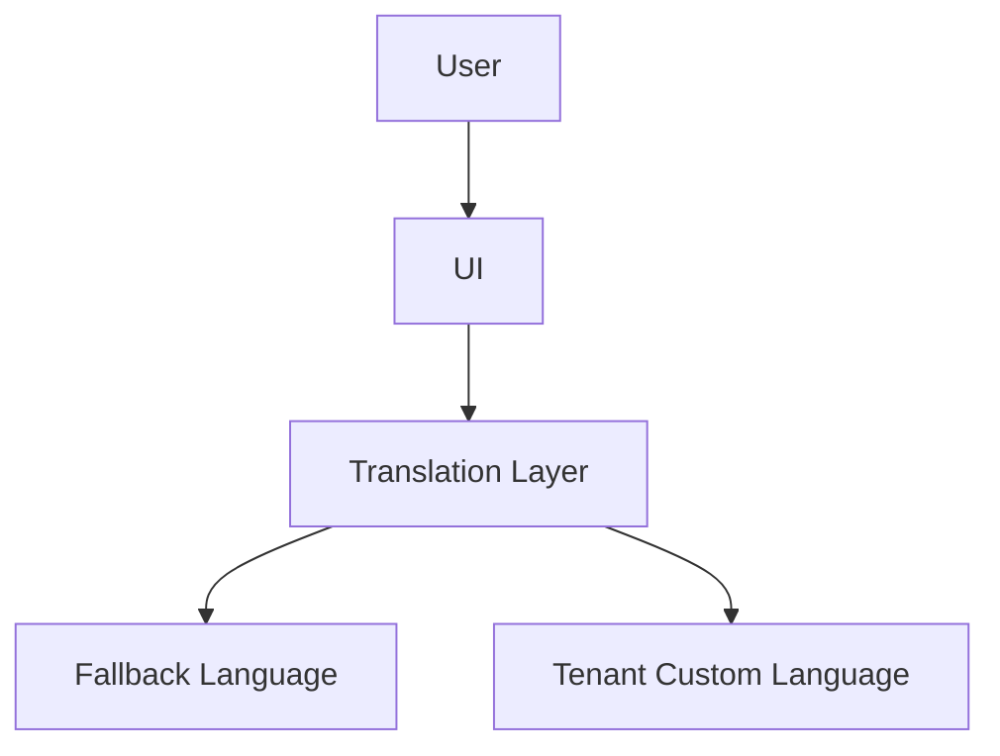

<!-- START doctoc generated TOC please keep comment here to allow auto update -->
<!-- DON'T EDIT THIS SECTION, INSTEAD RE-RUN doctoc TO UPDATE -->
## Table of Contents

- [Content Internationalization (i18n)](#content-internationalization-i18n)
  - [Overview](#overview)
  - [Prerequisites](#prerequisites)
  - [Setup](#setup)
  - [Usage](#usage)
  - [References](#references)
  - [Overview](#overview-1)
  - [Features](#features)
  - [Flow](#flow)
  - [Related Docs](#related-docs)

<!-- END doctoc generated TOC please keep comment here to allow auto update -->

# Content Internationalization (i18n)

## Overview
- This section outlines the primary goals and scope of Content I18N.

## Prerequisites
- Familiarity with basic Content I18N concepts and system requirements is recommended.

## Setup
- Follow these steps to configure and enable Content I18N in your environment.

## Usage
- Instructions and examples for applying Content I18N in day-to-day operations.

## References
- Additional resources and documentation about Content I18N for further learning.

## Overview
Handles multi-language content, translations, and RTL support.

## Features
- Language fallback (e.g., ar → en).
- RTL support for Arabic, Hebrew.
- JSON-based translation files.
- Tenant-specific branding & translations.

## Flow

## Related Docs
- [README.md](README.md)
- [MASTER_INDEX.md](MASTER_INDEX.md)

## Changelog
- Added Last Updated metadata

Last Updated: 2025-09-11 by ChatGPT
