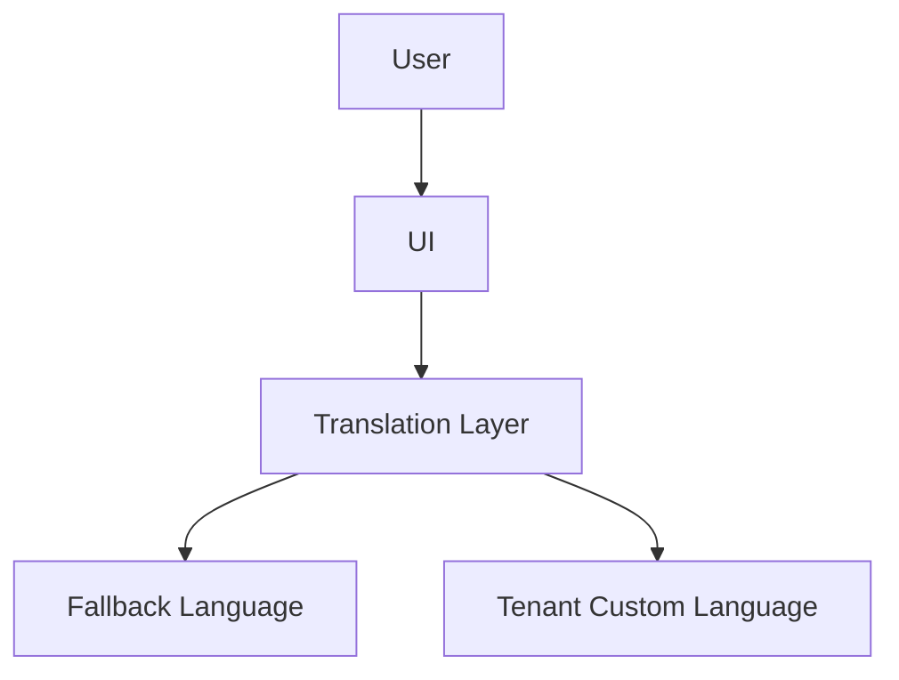

# Content Internationalization (i18n)

## Overview
- TBD

## Prerequisites
- TBD

## Setup
- TBD

## Usage
- TBD

## References
- TBD

## Overview
Handles multi-language content, translations, and RTL support.

## Features
- Language fallback (e.g., ar → en).
- RTL support for Arabic, Hebrew.
- JSON-based translation files.
- Tenant-specific branding & translations.

## Flow

