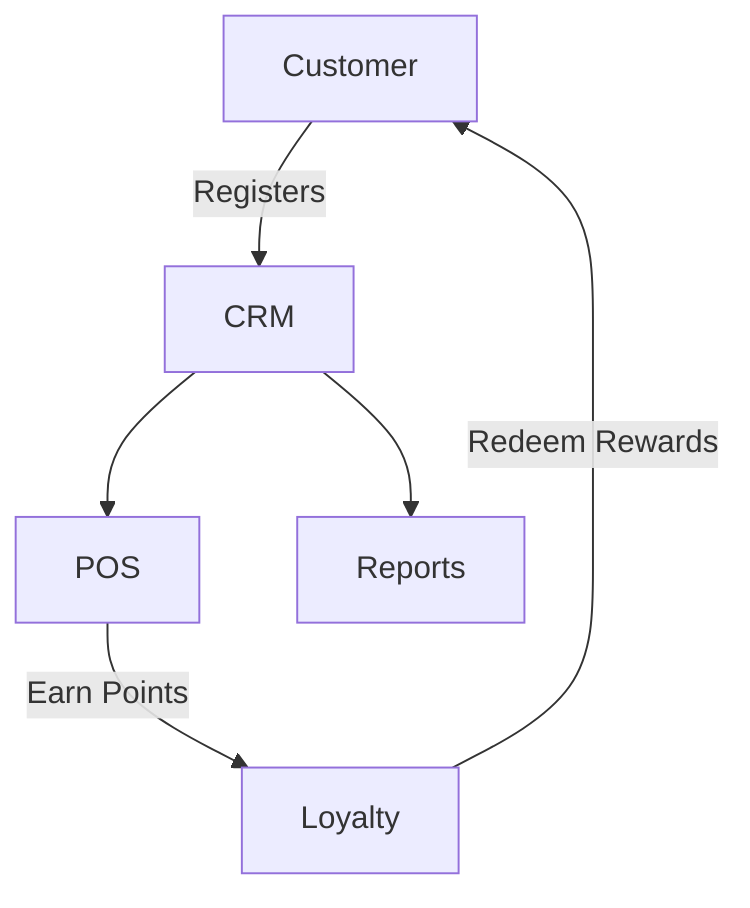

# CRM Module

## Overview
- This section outlines the primary goals and scope of Crm.

## Prerequisites
- Familiarity with basic Crm concepts and system requirements is recommended.

## Setup
- Follow these steps to configure and enable Crm in your environment.

## Usage
- Instructions and examples for applying Crm in day-to-day operations.

## References
- Additional resources and documentation about Crm for further learning.


## Overview
Manages customer data, preferences, loyalty programs, and coupons.

## Features
- Customer profiles and segmentation.  
- Loyalty points and rewards system.  
- Coupons and discount campaigns.  
- Customer feedback and preferences.  

## Workflow


## API
- `GET /api/crm/customers` – List customers.  
- `POST /api/crm/customers` – Create customer profile.  
- `POST /api/crm/loyalty/add` – Add loyalty points.
- `POST /api/crm/coupons/issue` – Issue coupon.

## Use Case
### Register a new customer
```bash
curl -X POST https://api.example.com/crm/customers \
  -H "Authorization: Bearer <token>" \
  -H "Content-Type: application/json" \
  -d '{"name":"John Doe","email":"john@example.com","phone":"+1555000111"}'
```

## Security
- Access restricted to tenant managers/authorized staff.
- GDPR compliance for customer data.

## Future Enhancements
- AI-based customer segmentation.  
- Predictive loyalty rewards.

## Related Docs
- [README.md](README.md)
- [MASTER_INDEX.md](MASTER_INDEX.md)

