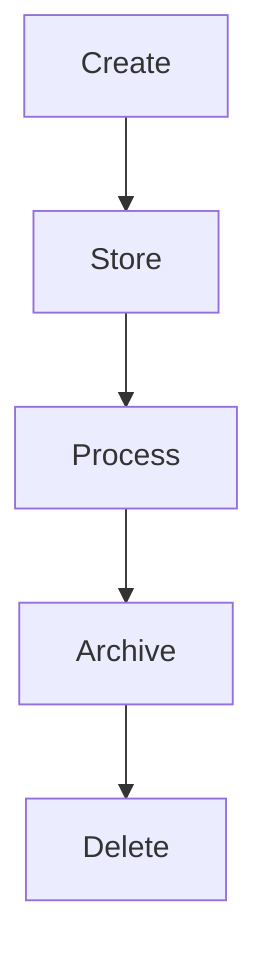

# Data Lifecycle

## Overview
Describes the lifecycle of data from creation to deletion, ensuring compliance.

## Stages
1. **Create** → data entered via POS/API/CRM.
2. **Store** → saved in tenant-specific DB schema.
3. **Process** → used by modules (Billing, Reports, CRM).
4. **Archive** → older data moved to cold storage (S3/Glacier).
5. **Delete** → on request (GDPR "Right to be Forgotten").

## Diagram

