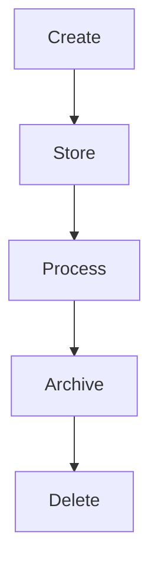

# Data Lifecycle

## Overview
- This section outlines the primary goals and scope of Data Lifecycle.

## Prerequisites
- Familiarity with basic Data Lifecycle concepts and system requirements is recommended.

## Setup
- Follow these steps to configure and enable Data Lifecycle in your environment.

## Usage
- Instructions and examples for applying Data Lifecycle in day-to-day operations.

## References
- Additional resources and documentation about Data Lifecycle for further learning.

## Overview
Describes the lifecycle of data from creation to deletion, ensuring compliance.

## Stages
1. **Create** → data entered via POS/API/CRM.
2. **Store** → saved in tenant-specific DB schema.
3. **Process** → used by modules (Billing, Reports, CRM).
4. **Archive** → older data moved to cold storage (S3/Glacier).
5. **Delete** → on request (GDPR "Right to be Forgotten").

## Diagram

