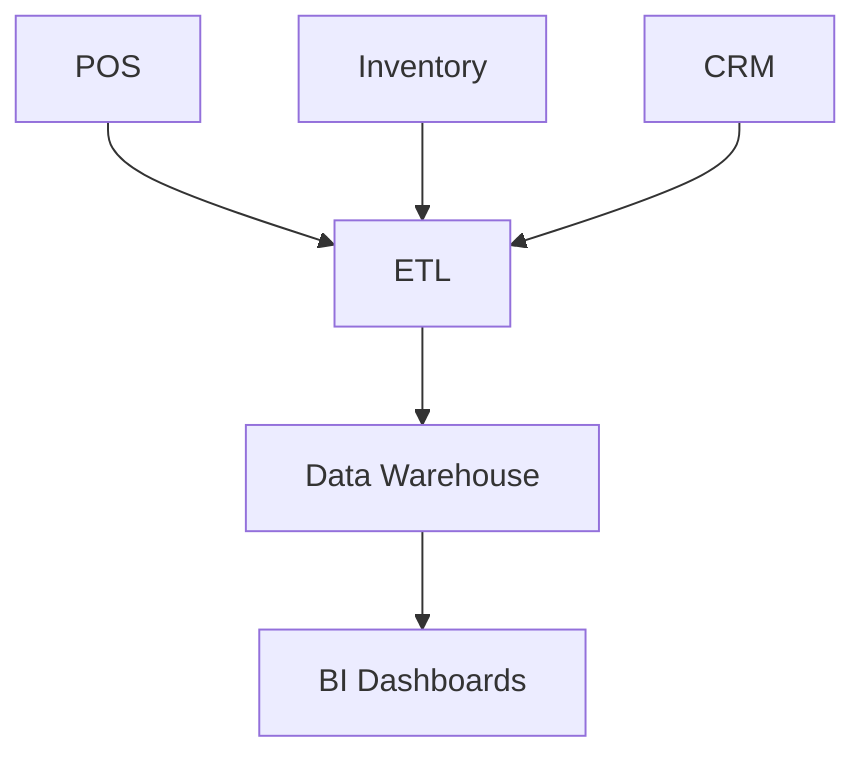

# Data Lineage

## Overview
- This section outlines the primary goals and scope of Data Lineage.

## Prerequisites
- Familiarity with basic Data Lineage concepts and system requirements is recommended.

## Setup
- Follow these steps to configure and enable Data Lineage in your environment.

## Usage
- Instructions and examples for applying Data Lineage in day-to-day operations.

## References
- Additional resources and documentation about Data Lineage for further learning.

## Overview
Tracks data flow from source to destination.

## Flow

