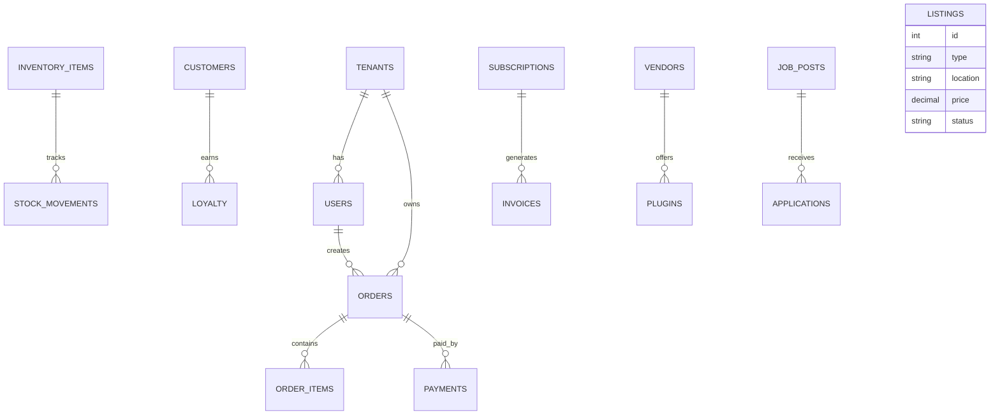

# Database Schema (High-Level ERD)

## Overview
- This section outlines the primary goals and scope of Db Schema.

## Prerequisites
- Familiarity with basic Db Schema concepts and system requirements is recommended.

## Setup
- Follow these steps to configure and enable Db Schema in your environment.

## Usage
- Instructions and examples for applying Db Schema in day-to-day operations.

## References
- Additional resources and documentation about Db Schema for further learning.

## Diagram

## Tenancy
- tenants (id, name, domain, db/schema reference)
- users (id, tenant_id, role_id, email, password)

## POS
- orders (id, tenant_id, customer_id, total, status)
- order_items (id, order_id, sku, qty, price)
- payments (id, order_id, method, status)

## Inventory
- items (id, tenant_id, sku, name, qty, expiry_date)
- stock_movements (id, item_id, change, reason)

## Billing
- subscriptions (id, tenant_id, plan, status)
- invoices (id, subscription_id, amount, status)

## CRM
- customers (id, tenant_id, name, email, preferences)
- loyalty (id, customer_id, points)

## Marketplace
- vendors (id, name, rating)
- plugins (id, vendor_id, module, status)

## Jobs
- job_posts (id, tenant_id, title, description)
- applications (id, job_post_id, applicant_name, status)

## Rentals
- listings (id, type, location, price, status)

## Related Docs
- [README.md](README.md)
- [MASTER_INDEX.md](MASTER_INDEX.md)

