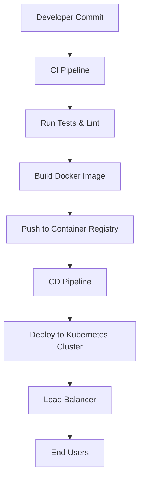

# Deployment Flow

## Overview
- This section outlines the primary goals and scope of Deployment Flow.

## Prerequisites
- Familiarity with basic Deployment Flow concepts and system requirements is recommended.

## Setup
- Follow these steps to configure and enable Deployment Flow in your environment.

## Usage
- Instructions and examples for applying Deployment Flow in day-to-day operations.

## References
- Additional resources and documentation about Deployment Flow for further learning.

## Overview
Describes how the system moves from developer commits to production deployment.

## Flow Diagram

## Notes
- GitHub Actions handles CI/CD.
- Docker images stored in container registry.
- Kubernetes used for production deployments.
- Helm charts manage application releases.

## See Also
- [Deployment Guide](DEPLOYMENT.md)

## Related Docs
- [README.md](README.md)
- [MASTER_INDEX.md](MASTER_INDEX.md)

