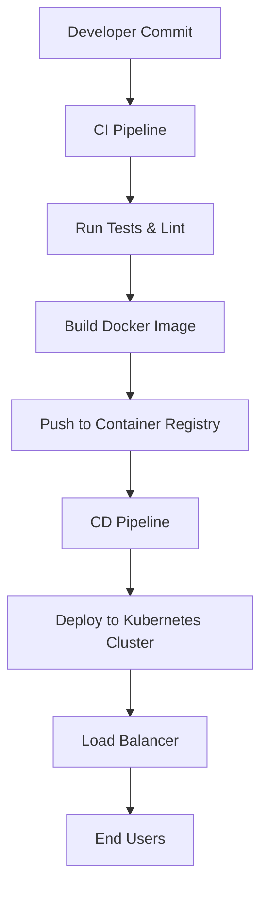

# Deployment Flow

## Overview
Describes how the system moves from developer commits to production deployment.

## Flow Diagram

## Notes
- GitHub Actions handles CI/CD.
- Docker images stored in container registry.
- Kubernetes used for production deployments.
- Helm charts manage application releases.
