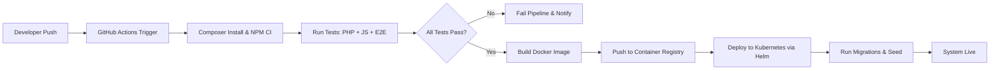

# DevOps Guide

## Local Setup
- Docker Compose with PHP 8.4, MySQL, Redis, Nginx.  
- Commands:  
```bash
docker compose up -d --build
```

## Production Setup
- Kubernetes cluster.  
- Helm charts for deployments.  
- Horizontal Pod Autoscaler.  

## CI/CD
- GitHub Actions workflow:  
  - Lint → Test → Build → Deploy.  
- Rollback strategies.  

### Pipeline Diagram


## Monitoring
- Sentry for error tracking.  
- ELK stack for logs.  
- Prometheus + Grafana for metrics.  
