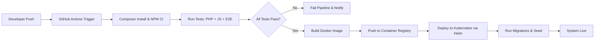

<!-- START doctoc generated TOC please keep comment here to allow auto update -->
<!-- DON'T EDIT THIS SECTION, INSTEAD RE-RUN doctoc TO UPDATE -->
## Table of Contents

- [DevOps Guide](#devops-guide)
  - [Overview](#overview)
  - [Prerequisites](#prerequisites)
  - [Setup](#setup)
  - [Usage](#usage)
  - [References](#references)
  - [Local Setup](#local-setup)
  - [Production Setup](#production-setup)
  - [CI/CD](#cicd)
    - [Pipeline Diagram](#pipeline-diagram)
  - [Monitoring](#monitoring)

<!-- END doctoc generated TOC please keep comment here to allow auto update -->

# DevOps Guide

## Overview
- This section outlines the primary goals and scope of Devops.

## Prerequisites
- Familiarity with basic Devops concepts and system requirements is recommended.

## Setup
- Follow these steps to configure and enable Devops in your environment.

## Usage
- Instructions and examples for applying Devops in day-to-day operations.

## References
- Additional resources and documentation about Devops for further learning.


## Local Setup
- Docker Compose with PHP 8.4, MySQL, Redis, Nginx.  
- Commands:  
```bash
docker compose up -d --build
```

## Production Setup
- Kubernetes cluster.  
- Helm charts for deployments.  
- Horizontal Pod Autoscaler.  

## CI/CD
- GitHub Actions workflow:  
  - Lint → Test → Build → Deploy.  
- Rollback strategies.  

### Pipeline Diagram


## Monitoring
- Sentry for error tracking.  
- ELK stack for logs.  
- Prometheus + Grafana for metrics.

## Related Docs
- [README.md](README.md)
- [MASTER_INDEX.md](MASTER_INDEX.md)

