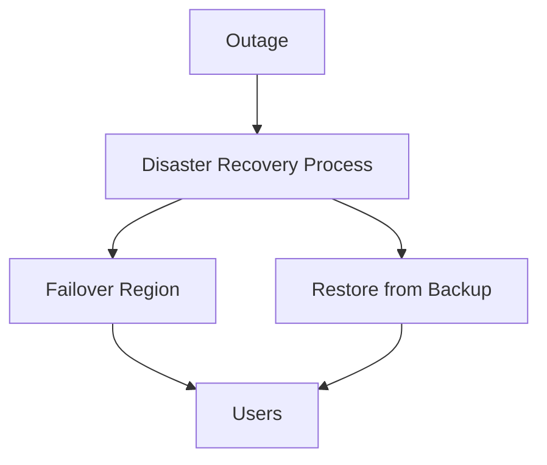

# Disaster Recovery Plan

## Overview
- This section outlines the primary goals and scope of Dr Plan.

## Prerequisites
- Familiarity with basic Dr Plan concepts and system requirements is recommended.

## Setup
- Follow these steps to configure and enable Dr Plan in your environment.

## Usage
- Instructions and examples for applying Dr Plan in day-to-day operations.

## References
- Additional resources and documentation about Dr Plan for further learning.

## Objectives
- RTO (Recovery Time Objective): <1h
- RPO (Recovery Point Objective): <15m

## Steps
1. Detect outage.
2. Notify engineering & support teams.
3. Switch traffic to standby region.
4. Restore from latest backup if needed.
5. Run post-mortem analysis.

## Diagram

## Related Docs
- [README.md](README.md)
- [MASTER_INDEX.md](MASTER_INDEX.md)

## Changelog
- Added Last Updated metadata

Last Updated: 2025-09-11 by ChatGPT
