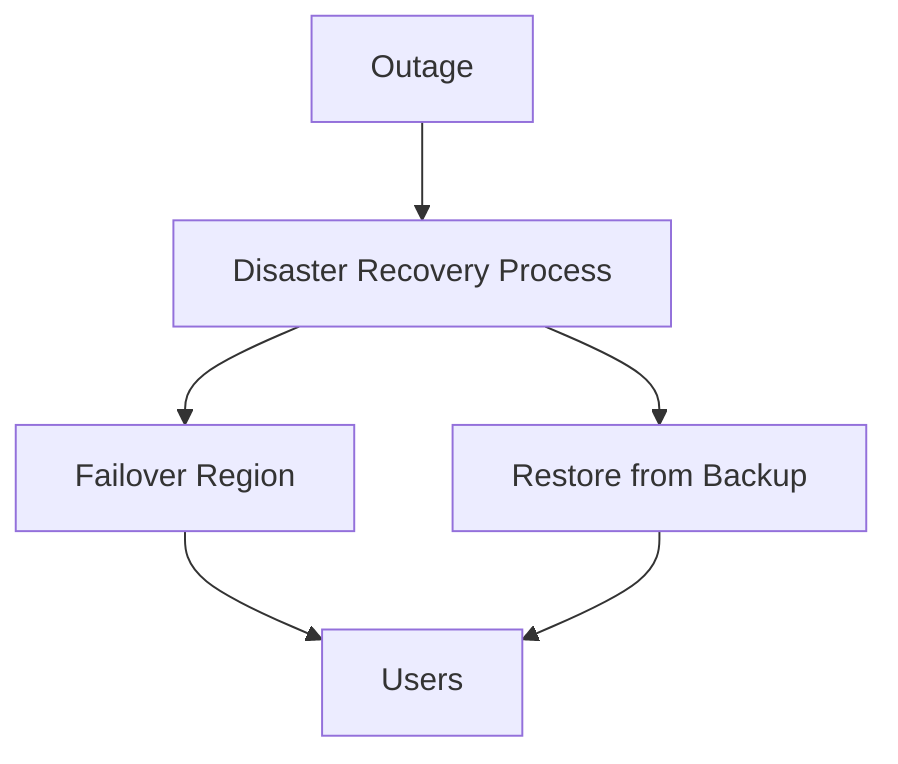

# Disaster Recovery Plan

## Overview
- TBD

## Prerequisites
- TBD

## Setup
- TBD

## Usage
- TBD

## References
- TBD

## Objectives
- RTO (Recovery Time Objective): <1h
- RPO (Recovery Point Objective): <15m

## Steps
1. Detect outage.
2. Notify engineering & support teams.
3. Switch traffic to standby region.
4. Restore from latest backup if needed.
5. Run post-mortem analysis.

## Diagram

