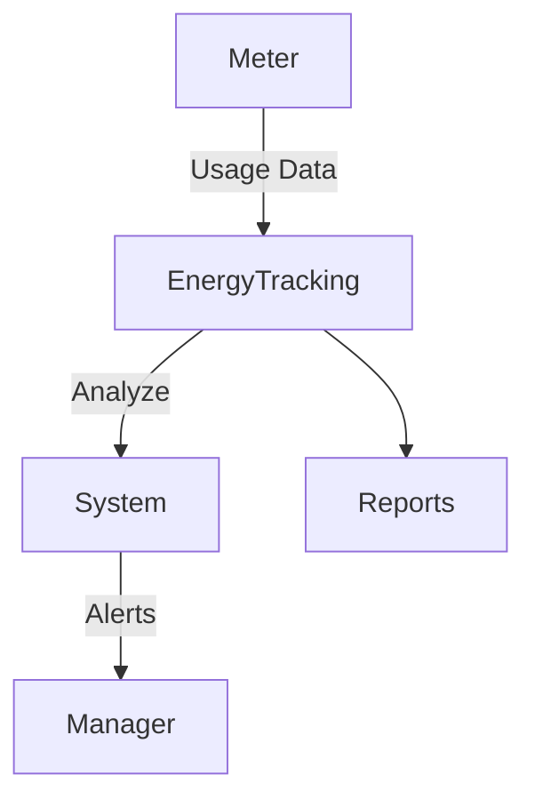

<!-- START doctoc generated TOC please keep comment here to allow auto update -->
<!-- DON'T EDIT THIS SECTION, INSTEAD RE-RUN doctoc TO UPDATE -->
## Table of Contents

- [Energy Tracking Module](#energy-tracking-module)
  - [Overview](#overview)
  - [Prerequisites](#prerequisites)
  - [Setup](#setup)
  - [Usage](#usage)
  - [References](#references)
  - [Overview](#overview-1)
  - [Features](#features)
  - [Workflow](#workflow)
  - [API](#api)
  - [Security](#security)
  - [Future Enhancements](#future-enhancements)
  - [Related Docs](#related-docs)

<!-- END doctoc generated TOC please keep comment here to allow auto update -->

# Energy Tracking Module

## Overview
- This section outlines the primary goals and scope of Energy Tracking.

## Prerequisites
- Familiarity with basic Energy Tracking concepts and system requirements is recommended.

## Setup
- Follow these steps to configure and enable Energy Tracking in your environment.

## Usage
- Instructions and examples for applying Energy Tracking in day-to-day operations.

## References
- Additional resources and documentation about Energy Tracking for further learning.

## Overview
Monitors energy and water usage to optimize resource consumption.

## Features
- Track electricity and water usage.  
- Generate efficiency reports.  
- Alert on abnormal consumption.  

## Workflow

## API
- `GET /api/energy/usage` – Retrieve usage data.  
- `POST /api/energy/log` – Add usage entry.  

## Security
- Data integrity checks.  
- Restricted access to managers.  

## Future Enhancements
- IoT smart meter integration.  
- AI-driven energy optimization.

## Related Docs
- [README.md](README.md)
- [MASTER_INDEX.md](MASTER_INDEX.md)

## Changelog
- Added Last Updated metadata

Last Updated: 2025-09-11 by ChatGPT
