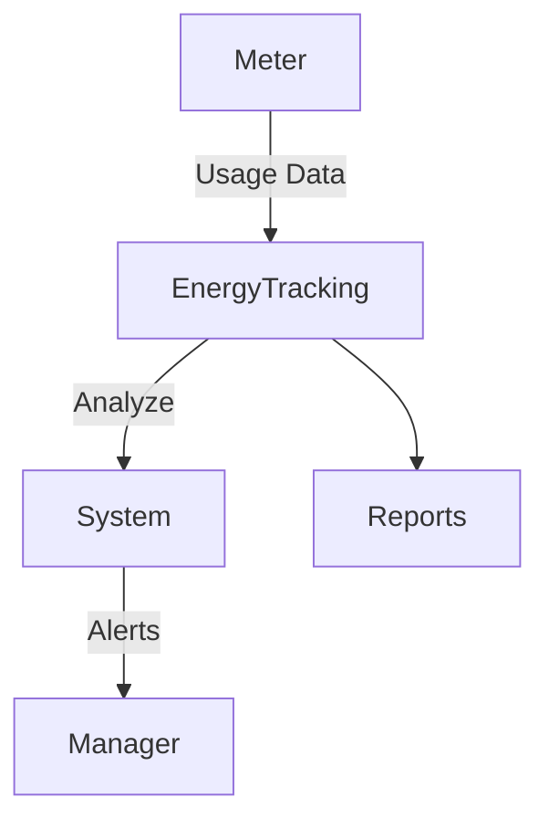

# Energy Tracking Module

## Overview
Monitors energy and water usage to optimize resource consumption.

## Features
- Track electricity and water usage.  
- Generate efficiency reports.  
- Alert on abnormal consumption.  

## Workflow

## API
- `GET /api/energy/usage` – Retrieve usage data.  
- `POST /api/energy/log` – Add usage entry.  

## Security
- Data integrity checks.  
- Restricted access to managers.  

## Future Enhancements
- IoT smart meter integration.  
- AI-driven energy optimization.  
