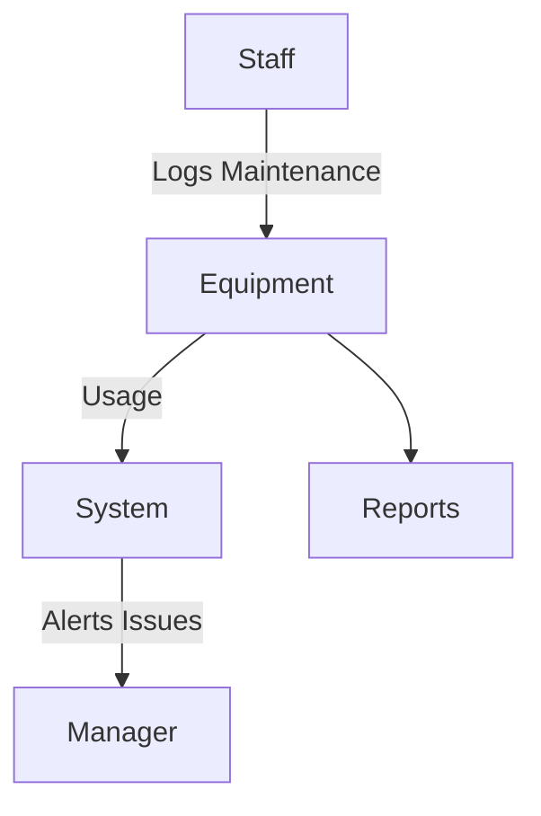

# Equipment Module

## Overview
Tracks maintenance and lifecycle of equipment in cafes/restaurants.

## Features
- Register equipment and track usage.  
- Log maintenance activities.  
- Alerts for required servicing.  
- Reports on equipment health.  

## Workflow

## API
- `POST /api/equipment/register` – Register equipment.  
- `POST /api/equipment/maintenance` – Log maintenance activity.  
- `GET /api/equipment/reports` – Equipment reports.  

## Security
- Authorized staff only.  
- Audit logs for maintenance activities.  

## Future Enhancements
- IoT sensors for predictive maintenance.  
- Integration with vendor service contracts.  
