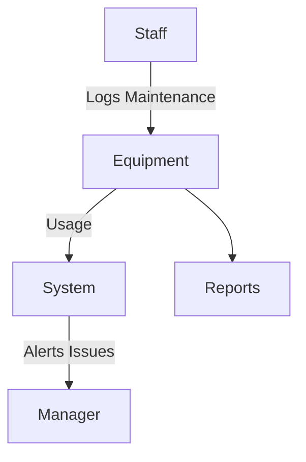

# Equipment Module

## Overview
- This section outlines the primary goals and scope of Equipment.

## Prerequisites
- Familiarity with basic Equipment concepts and system requirements is recommended.

## Setup
- Follow these steps to configure and enable Equipment in your environment.

## Usage
- Instructions and examples for applying Equipment in day-to-day operations.

## References
- Additional resources and documentation about Equipment for further learning.

## Overview
Tracks maintenance and lifecycle of equipment in cafes/restaurants.

## Features
- Register equipment and track usage.  
- Log maintenance activities.  
- Alerts for required servicing.  
- Reports on equipment health.  

## Workflow

## API
- `POST /api/equipment/register` – Register equipment.  
- `POST /api/equipment/maintenance` – Log maintenance activity.  
- `GET /api/equipment/reports` – Equipment reports.  

## Security
- Authorized staff only.  
- Audit logs for maintenance activities.  

## Future Enhancements
- IoT sensors for predictive maintenance.  
- Integration with vendor service contracts.

## Related Docs
- [README.md](README.md)
- [MASTER_INDEX.md](MASTER_INDEX.md)

