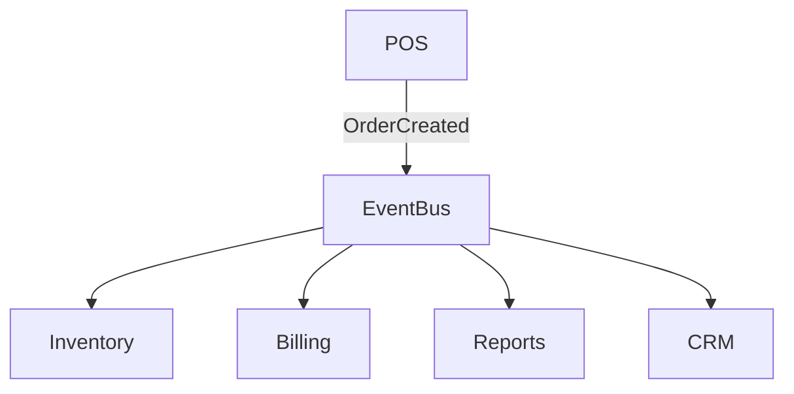

<!-- START doctoc generated TOC please keep comment here to allow auto update -->
<!-- DON'T EDIT THIS SECTION, INSTEAD RE-RUN doctoc TO UPDATE -->
## Table of Contents

- [Event Bus](#event-bus)
  - [Overview](#overview)
  - [Prerequisites](#prerequisites)
  - [Setup](#setup)
  - [Usage](#usage)
  - [References](#references)
  - [Overview](#overview-1)
  - [Event Types](#event-types)
  - [Technology](#technology)
  - [Flow](#flow)
  - [Related Docs](#related-docs)

<!-- END doctoc generated TOC please keep comment here to allow auto update -->

# Event Bus

## Overview
- This section outlines the primary goals and scope of Event Bus.

## Prerequisites
- Familiarity with basic Event Bus concepts and system requirements is recommended.

## Setup
- Follow these steps to configure and enable Event Bus in your environment.

## Usage
- Instructions and examples for applying Event Bus in day-to-day operations.

## References
- Additional resources and documentation about Event Bus for further learning.

## Overview
The Event Bus enables decoupled communication between modules via Pub/Sub.

## Event Types
- OrderCreated
- OrderUpdated
- PaymentProcessed
- InventoryLowStock
- ReservationBooked
- TenantCreated
- ModuleEnabled/Disabled

## Technology
- Laravel Events & Listeners
- Redis Pub/Sub
- Horizon workers for async

## Flow

## Related Docs
- [README.md](README.md)
- [MASTER_INDEX.md](MASTER_INDEX.md)

