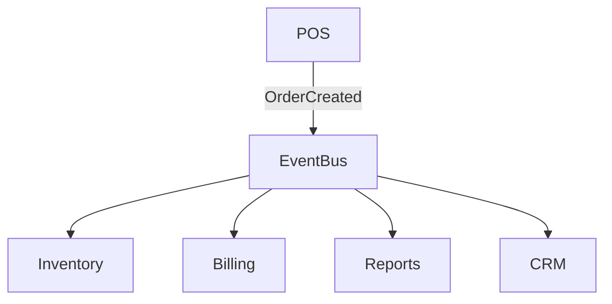

# Event Bus

## Overview
The Event Bus enables decoupled communication between modules via Pub/Sub.

## Event Types
- OrderCreated
- OrderUpdated
- PaymentProcessed
- InventoryLowStock
- ReservationBooked
- TenantCreated
- ModuleEnabled/Disabled

## Technology
- Laravel Events & Listeners
- Redis Pub/Sub
- Horizon workers for async

## Flow

