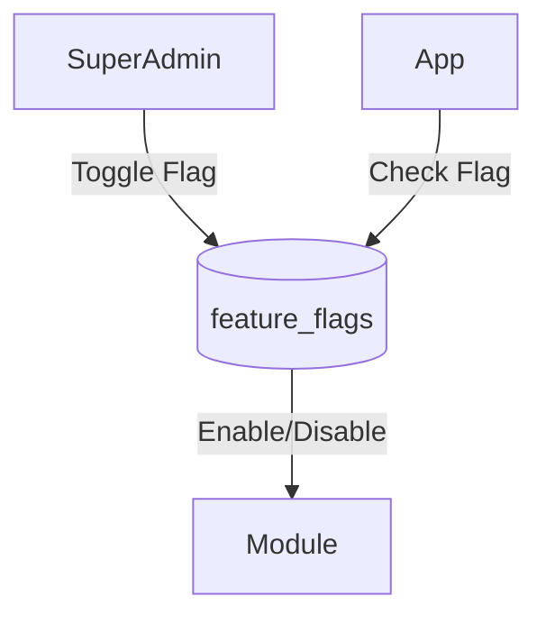

# Feature Flags

## Overview
Feature flags allow enabling/disabling modules per tenant.

## Storage
- `feature_flags` table with tenant_id, module, enabled.

## Flow

```mermaid
flowchart TD
    SuperAdmin -->|Toggle Flag| DB[(feature_flags)]
    App -->|Check Flag| DB
    DB -->|Enable/Disable| Module
```
