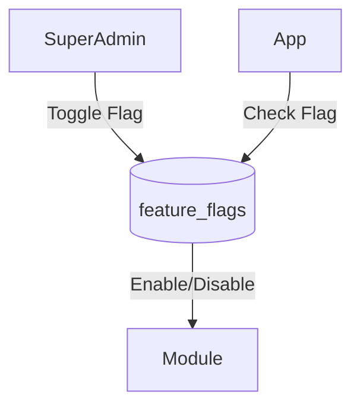

# Feature Flags

## Overview
- This section outlines the primary goals and scope of Feature Flags.

## Prerequisites
- Familiarity with basic Feature Flags concepts and system requirements is recommended.

## Setup
- Follow these steps to configure and enable Feature Flags in your environment.

## Usage
- Instructions and examples for applying Feature Flags in day-to-day operations.

## References
- Additional resources and documentation about Feature Flags for further learning.

## Overview
Feature flags allow enabling/disabling modules per tenant.

## Storage
- `feature_flags` table with tenant_id, module, enabled.

## Flow

