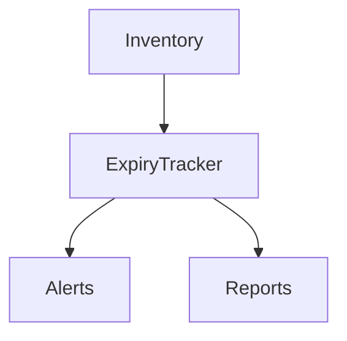

# Food Expiry Tracking

## Overview
- This section outlines the primary goals and scope of Food Expiry.

## Prerequisites
- Familiarity with basic Food Expiry concepts and system requirements is recommended.

## Setup
- Follow these steps to configure and enable Food Expiry in your environment.

## Usage
- Instructions and examples for applying Food Expiry in day-to-day operations.

## References
- Additional resources and documentation about Food Expiry for further learning.

## Overview
Tracks expiry dates for perishable items.

## Features
- Batch-based expiry
- Alerts before expiry
- Auto-removal from availability

## Flow

## Related Docs
- [README.md](README.md)
- [MASTER_INDEX.md](MASTER_INDEX.md)

## Changelog
- Added Last Updated metadata

Last Updated: 2025-09-11 by ChatGPT
