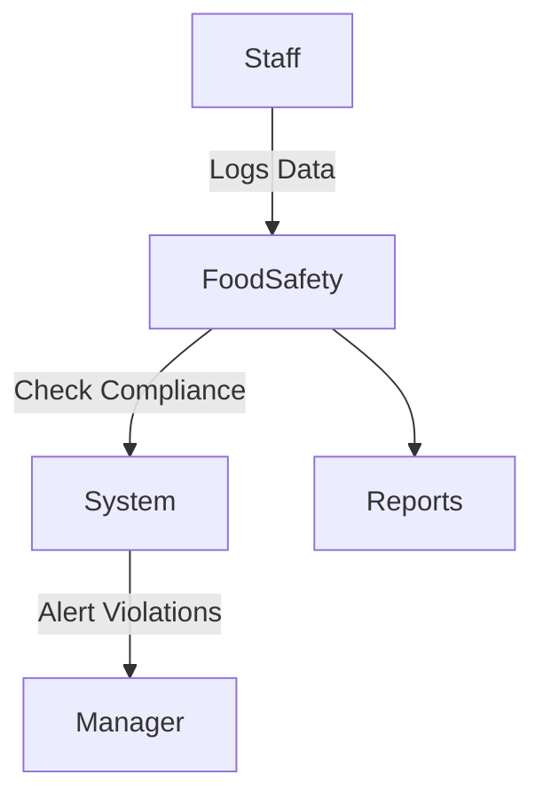

# Food Safety Module

## Overview
- TBD

## Prerequisites
- TBD

## Setup
- TBD

## Usage
- TBD

## References
- TBD

## Overview
Ensures compliance with food safety standards (HACCP, temperature logs, cleaning schedules).

## Features
- Record food temperature logs.  
- Track cleaning and hygiene schedules.  
- Generate compliance reports.  
- Alerts for safety violations.  

## Workflow

## API
- `POST /api/foodsafety/logs` – Add safety log.  
- `GET /api/foodsafety/logs` – Retrieve safety logs.  
- `GET /api/foodsafety/reports` – Generate compliance report.  

## Security
- Restricted to managers and authorized staff.  
- Tamper-proof audit logs.  

## Future Enhancements
- IoT temperature sensors integration.  
- Predictive food safety analytics.  
