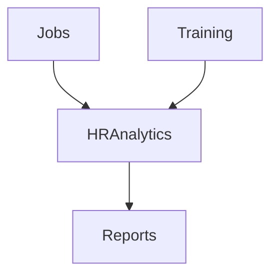

<!-- START doctoc generated TOC please keep comment here to allow auto update -->
<!-- DON'T EDIT THIS SECTION, INSTEAD RE-RUN doctoc TO UPDATE -->
## Table of Contents

- [HR Analytics (Jobs & Training)](#hr-analytics-jobs--training)
  - [Overview](#overview)
  - [Prerequisites](#prerequisites)
  - [Setup](#setup)
  - [Usage](#usage)
  - [References](#references)
  - [Overview](#overview-1)
  - [Jobs KPIs](#jobs-kpis)
  - [Training KPIs](#training-kpis)
  - [Flow](#flow)

<!-- END doctoc generated TOC please keep comment here to allow auto update -->

# HR Analytics (Jobs & Training)

## Overview
- This section outlines the primary goals and scope of Hr Analytics.

## Prerequisites
- Familiarity with basic Hr Analytics concepts and system requirements is recommended.

## Setup
- Follow these steps to configure and enable Hr Analytics in your environment.

## Usage
- Instructions and examples for applying Hr Analytics in day-to-day operations.

## References
- Additional resources and documentation about Hr Analytics for further learning.

## Overview
Analytics for HR-related modules.

## Jobs KPIs
- Time to hire
- Application to interview ratio

## Training KPIs
- Training completion rate
- Post-training performance improvement

## Flow

