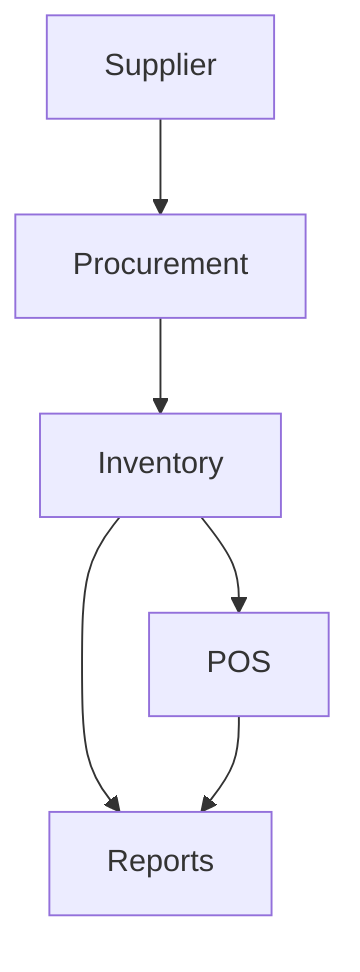

# Inventory Module

## Overview
- This section outlines the primary goals and scope of Inventory.

## Prerequisites
- Familiarity with basic Inventory concepts and system requirements is recommended.

## Setup
- Follow these steps to configure and enable Inventory in your environment.

## Usage
- Instructions and examples for applying Inventory in day-to-day operations.

## References
- Additional resources and documentation about Inventory for further learning.


## Overview
Tracks stock levels, batches, and reorder workflows across locations.

## Features
- SKU and batch tracking with expirations.  
- Automatic reorder triggers.  
- Stock movement auditing.  

## Workflow


## API
- `GET /api/inventory/items` – Retrieve inventory items.  
- `POST /api/inventory/adjust` – Adjust stock levels.  

## Examples
```bash
curl -X POST /api/inventory/adjust -d 'sku=123&qty=-1'
```

## Security
- Tenant isolation for stock data.  
- Role-based access (managers, stock controllers).  

## Future Enhancements
- Supplier lead-time forecasting.  
- Barcode scanning & IoT sensor integration.  
