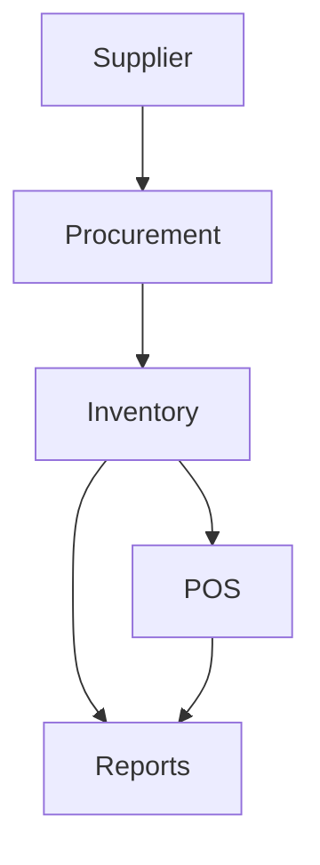

<!-- START doctoc generated TOC please keep comment here to allow auto update -->
<!-- DON'T EDIT THIS SECTION, INSTEAD RE-RUN doctoc TO UPDATE -->
## Table of Contents

- [Inventory Module](#inventory-module)
  - [Overview](#overview)
  - [Prerequisites](#prerequisites)
  - [Setup](#setup)
  - [Usage](#usage)
    - [Workflow](#workflow)
    - [API](#api)
    - [Examples](#examples)
    - [Security](#security)
    - [Future Enhancements](#future-enhancements)
  - [References](#references)
  - [Related Docs](#related-docs)

<!-- END doctoc generated TOC please keep comment here to allow auto update -->

# Inventory Module

## Overview
- This section outlines the primary goals and scope of Inventory.
- Tracks stock levels, batches, and reorder workflows across locations.
- Features include SKU and batch tracking with expirations, automatic reorder triggers, and stock movement auditing.

## Prerequisites
- Familiarity with basic Inventory concepts and system requirements is recommended.

## Setup
- Follow these steps to configure and enable Inventory in your environment.

## Usage
- Instructions and examples for applying Inventory in day-to-day operations.

### Workflow
The following diagram shows how inventory interacts with other modules.


### API
- `GET /api/inventory/items` – Retrieve inventory items.
- `POST /api/inventory/adjust` – Adjust stock levels.

### Examples
```bash
curl -X POST /api/inventory/adjust -d 'sku=123&qty=-1'
```

### Security
- Tenant isolation for stock data.
- Role-based access (managers, stock controllers).

### Future Enhancements
- Supplier lead-time forecasting.
- Barcode scanning & IoT sensor integration.

## References
- Additional resources and documentation about Inventory for further learning.

## Related Docs
- [README.md](README.md)
- [MASTER_INDEX.md](MASTER_INDEX.md)


## Changelog
- Added Last Updated metadata

Last Updated: 2025-09-11 by ChatGPT
