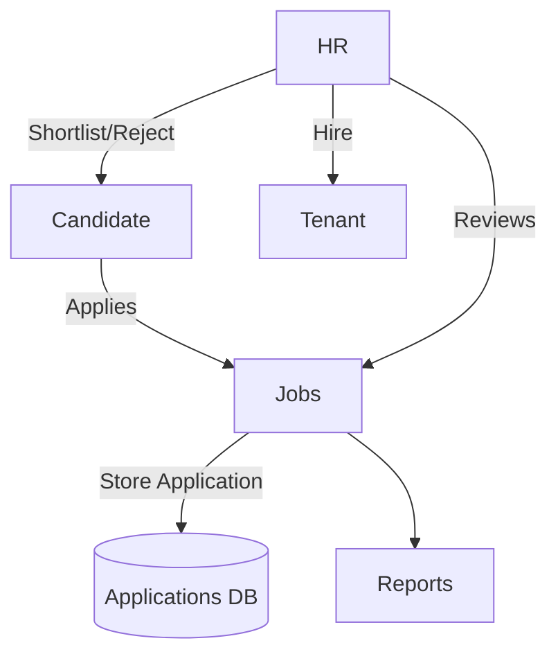

# Jobs Module

## Overview
- This section outlines the primary goals and scope of Jobs.

## Prerequisites
- Familiarity with basic Jobs concepts and system requirements is recommended.

## Setup
- Follow these steps to configure and enable Jobs in your environment.

## Usage
- Instructions and examples for applying Jobs in day-to-day operations.

## References
- Additional resources and documentation about Jobs for further learning.

## Overview
Manages recruitment processes, job postings, and candidate applications.

## Features
- Post new job listings.  
- Manage applications from candidates.  
- HR review and interview tracking.  
- Hire/reject workflows.  

## Workflow

## API
- `GET /api/jobs/posts` – List job posts.  
- `POST /api/jobs/posts` – Create job post.  
- `POST /api/jobs/applications` – Submit application.  

## Security
- Only tenant admins/HR staff can manage jobs.  
- Candidate data protected under GDPR.  

## Future Enhancements
- AI-driven CV screening.  
- Video interview integration.

## Related Docs
- [README.md](README.md)
- [MASTER_INDEX.md](MASTER_INDEX.md)

