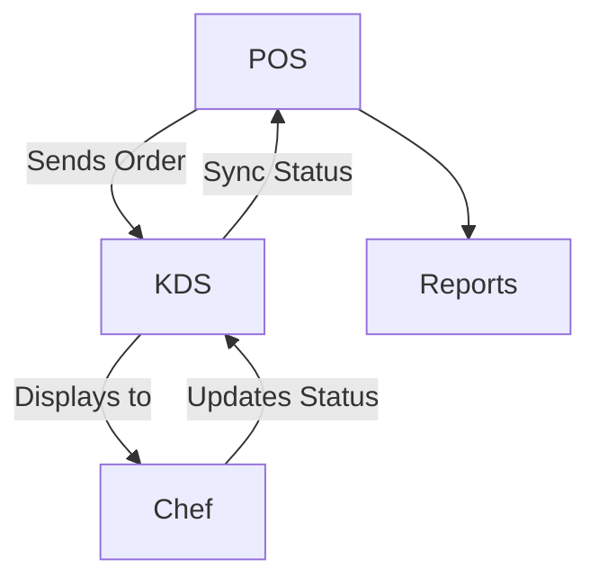

# Kitchen Display System (KDS) Module

## Overview
Displays incoming orders from POS to the kitchen for preparation and tracking.

## Features
- Real-time order updates from POS.  
- Order status management (new, in-progress, ready).  
- Supports multiple kitchen stations (drinks, hot food, desserts).  
- Syncs order status back to POS.  

## Workflow

## API
- `GET /api/kds/orders` – Get pending kitchen orders.  
- `POST /api/kds/orders/{id}/status` – Update order status.  

## Security
- Restricted access for kitchen staff only.  
- Tenant isolation for order data.  

## Future Enhancements
- Voice alerts for new orders.  
- Smart kitchen device integration (IoT).  
