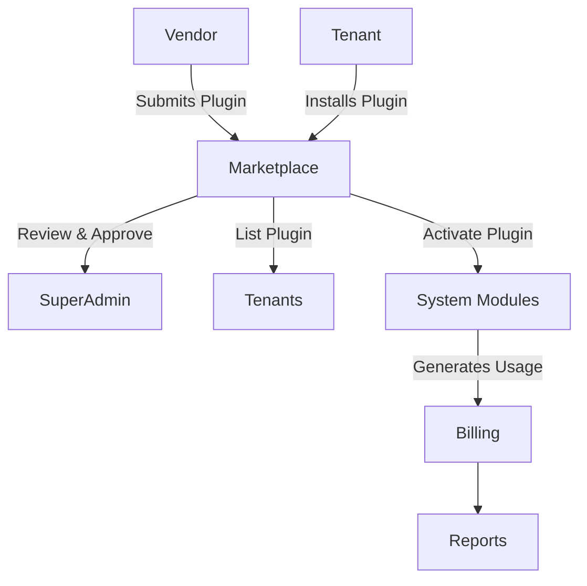

# Marketplace Module

## Overview
- This section outlines the primary goals and scope of Marketplace.

## Prerequisites
- Familiarity with basic Marketplace concepts and system requirements is recommended.

## Setup
- Follow these steps to configure and enable Marketplace in your environment.

## Usage
- Instructions and examples for applying Marketplace in day-to-day operations.

## References
- Additional resources and documentation about Marketplace for further learning.


## Overview
Connects cafes with third-party vendors for supplies and integrations.

## Features
- Vendor listing and rating.  
- Plugin marketplace with one-click installs.  
- Revenue sharing and billing integration.  

## Workflow: Plugin Lifecycle


## API
- `GET /api/marketplace/vendors` – List available vendors.  

## Examples
```bash
curl /api/marketplace/vendors
```

## Security
- Vendor onboarding with KYC checks.  
- Revenue tracking with audit logs.  

## Future Enhancements
- In-app purchases.  
- Plugin rating and review system.  
