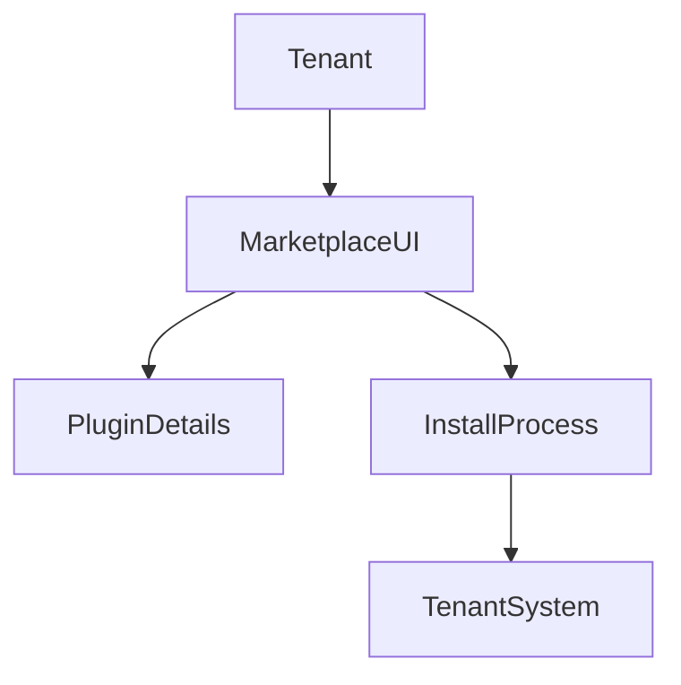

# Marketplace UI

## Overview
- This section outlines the primary goals and scope of Marketplace Ui.

## Prerequisites
- Familiarity with basic Marketplace Ui concepts and system requirements is recommended.

## Setup
- Follow these steps to configure and enable Marketplace Ui in your environment.

## Usage
- Instructions and examples for applying Marketplace Ui in day-to-day operations.

## References
- Additional resources and documentation about Marketplace Ui for further learning.

## Overview
Describes the App Store-like experience for tenants.

## Features
- Browse plugins by category
- Search & filter
- Install/uninstall modules
- Reviews & ratings

## Flow

## Related Docs
- [README.md](README.md)
- [MASTER_INDEX.md](MASTER_INDEX.md)

## Changelog
- Added Last Updated metadata

Last Updated: 2025-09-11 by ChatGPT
