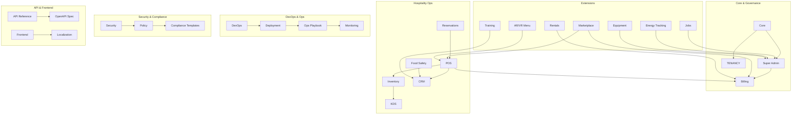

<!-- START doctoc generated TOC please keep comment here to allow auto update -->
<!-- DON'T EDIT THIS SECTION, INSTEAD RE-RUN doctoc TO UPDATE -->
## Table of Contents

- [EliteSaaS Documentation Hub](#elitesaas-documentation-hub)
  - [Overview](#overview)
  - [Prerequisites](#prerequisites)
  - [Setup](#setup)
  - [Usage](#usage)
  - [References](#references)
  - [📊 Platform Map (High-Level)](#-platform-map-high-level)
- [📖 Table of Contents](#-table-of-contents)
  - [🚀 General Docs](#-general-docs)
  - [🏛 Core & Governance](#-core--governance)
  - [🍽 Hospitality Ops](#-hospitality-ops)
  - [🔌 Extensions](#-extensions)
  - [⚙️ DevOps & Operations](#-devops--operations)
  - [🔒 Security & Compliance](#-security--compliance)
  - [🧪 Testing & Localization](#-testing--localization)
  - [🎨 Frontend](#-frontend)
  - [📡 API & Monitoring](#-api--monitoring)
  - [👩‍💻 Contribution](#-contribution)
  - [📂 Config & Environment](#-config--environment)
  - [✅ Summary](#-summary)

<!-- END doctoc generated TOC please keep comment here to allow auto update -->

# EliteSaaS Documentation Hub

## Overview
- This section outlines the primary goals and scope of Master Index.

## Prerequisites
- Familiarity with basic Master Index concepts and system requirements is recommended.

## Setup
- Follow these steps to configure and enable Master Index in your environment.

## Usage
- Instructions and examples for applying Master Index in day-to-day operations.

## References
- Additional resources and documentation about Master Index for further learning.

Welcome to the **EliteSaaS Platform** documentation hub.  
This file serves as the single entry point and Table of Contents for all documentation.

---

## 📊 Platform Map (High-Level)

---

# 📖 Table of Contents

- [🚀 General Docs](#-general-docs)  
- [🏛 Core & Governance](#-core--governance)  
- [🍽 Hospitality Ops](#-hospitality-ops)  
- [🔌 Extensions](#-extensions)  
- [⚙️ DevOps & Operations](#-devops--operations)  
- [🔒 Security & Compliance](#-security--compliance)  
- [🧪 Testing & Localization](#-testing--localization)  
- [🎨 Frontend](#-frontend)  
- [📡 API & Monitoring](#-api--monitoring)  
- [👩‍💻 Contribution](#-contribution)  
- [📂 Config & Environment](#-config--environment)  

---

## 🚀 General Docs
- [README.md](README.md) → Project overview, stack, quick start.  
- [TECH_GUIDE.md](TECH_GUIDE.md) → Architecture & standards (with diagrams).  
- [AGENTS.md](AGENTS.md) → Modules documentation + workflows.  
- [CHANGELOG.md](CHANGELOG.md) → Release history.  

---

## 🏛 Core & Governance
- [BILLING.md](BILLING.md) → Subscription, invoicing, money flow.  
- [TENANCY.md](TENANCY.md) → Multi-tenancy migration & rollback.  
- [POLICY.md](POLICY.md) → Data retention, backups, SLA.  

---

## 🍽 Hospitality Ops
- [POS.md](POS.md) → End-to-end restaurant operations.  
- [INVENTORY.md](INVENTORY.md) → Procurement to POS flow.  
- [KDS.md](KDS.md) → Kitchen Display System.  
- [CRM.md](CRM.md) → Customer & loyalty cycle.  
- [RESERVATIONS.md](RESERVATIONS.md) → Table booking workflow.  
- [FOOD_SAFETY.md](FOOD_SAFETY.md) → HACCP & compliance logging.  

---

## 🔌 Extensions
- [MARKETPLACE.md](MARKETPLACE.md) → Plugin lifecycle.  
- [JOBS.md](JOBS.md) → Recruitment & hiring workflow.  
- [RENTALS.md](RENTALS.md) → Rental listings & contracts.  
- [TRAINING.md](TRAINING.md) → Staff training & evaluation cycle.  
- [ENERGY_TRACKING.md](ENERGY_TRACKING.md) → Monitoring energy & water.  
- [EQUIPMENT.md](EQUIPMENT.md) → Equipment lifecycle.  

---

## ⚙️ DevOps & Operations
- [DEVOPS.md](DEVOPS.md) → Local & production setup, CI/CD pipeline.  
- [DEPLOYMENT.md](DEPLOYMENT.md) → Secrets & environments.  
- [OPS_PLAYBOOK.md](OPS_PLAYBOOK.md) → Incident response flows.  

---

## 🔒 Security & Compliance
- [SECURITY.md](SECURITY.md) → Auth, RBAC, GDPR, PCI DSS.  
- [COMPLIANCE_TEMPLATES.md](COMPLIANCE_TEMPLATES.md) → GDPR/Privacy templates.  

---

## 🧪 Testing & Localization
- [TESTING.md](TESTING.md) → Unit, integration, E2E strategy.  
- [LOCALIZATION.md](LOCALIZATION.md) → i18n, RTL, tenant branding.  

---

## 🎨 Frontend
- [FRONTEND.md](FRONTEND.md) → Vue/Inertia/Tailwind structure & theming.  

---

## 📡 API & Monitoring
- [API_REFERENCE.md](API_REFERENCE.md) → API endpoints & error codes.  
- [openapi.yaml](openapi.yaml) → OpenAPI spec.  
- [MONITORING.md](MONITORING.md) → Monitoring setup (Sentry, ELK, Grafana).  

---

## 👩‍💻 Contribution
- [CONTRIBUTING.md](CONTRIBUTING.md) → Coding standards & Git flow.  

---

## 📂 Config & Environment
- [nginx.conf](nginx.conf) → Nginx config for Laravel.  
- [docker-compose.yml](docker-compose.yml) → Local dev environment.  
- [.env.example](.env.example) → Example env variables.  
- [DB_SCHEMA.md](DB_SCHEMA.md) → Database schema + ERD.  
- [SEEDING.md](SEEDING.md) → Seed data (roles, tenants, products).  

---

## ✅ Summary
This documentation package provides everything needed to:  
- Understand the architecture.  
- Work with hospitality ops modules.  
- Extend the platform with plugins.  
- Operate, scale, and secure the system.  
- Develop frontend & APIs.  
- Ensure compliance & testing.  

Use this **MASTER_INDEX.md** as your main hub.
