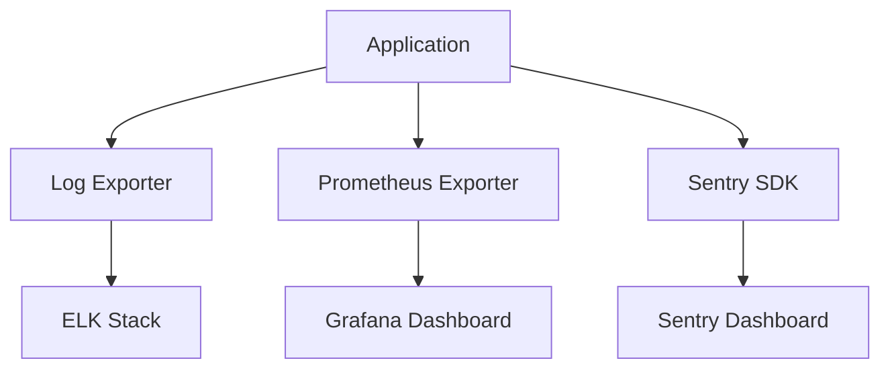

# Monitoring Flow

## Overview
- TBD

## Prerequisites
- TBD

## Setup
- TBD

## Usage
- TBD

## References
- TBD

## Overview
Shows how logs, metrics, and errors flow from the application to monitoring tools.

## Flow Diagram

## Notes
- **Sentry**: error tracking and alerting.
- **Prometheus + Grafana**: metrics visualization.
- **ELK Stack**: log aggregation and analysis.

## See Also
- [Monitoring & Alerting Guide](MONITORING.md)
- [Observability](OBSERVABILITY.md)
