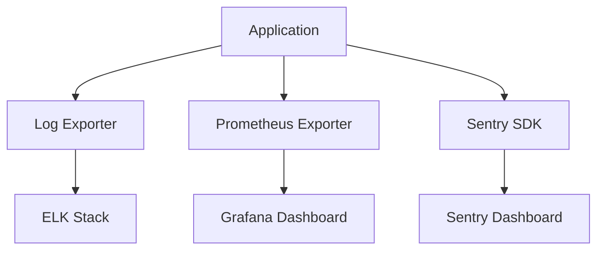

# Monitoring Flow

## Overview
- This section outlines the primary goals and scope of Monitoring Flow.

## Prerequisites
- Familiarity with basic Monitoring Flow concepts and system requirements is recommended.

## Setup
- Follow these steps to configure and enable Monitoring Flow in your environment.

## Usage
- Instructions and examples for applying Monitoring Flow in day-to-day operations.

## References
- Additional resources and documentation about Monitoring Flow for further learning.

## Overview
Shows how logs, metrics, and errors flow from the application to monitoring tools.

## Flow Diagram

## Notes
- **Sentry**: error tracking and alerting.
- **Prometheus + Grafana**: metrics visualization.
- **ELK Stack**: log aggregation and analysis.

## See Also
- [Monitoring & Alerting Guide](MONITORING.md)
- [Observability](OBSERVABILITY.md)

## Related Docs
- [README.md](README.md)
- [MASTER_INDEX.md](MASTER_INDEX.md)

## Changelog
- Added Last Updated metadata

Last Updated: 2025-09-11 by ChatGPT
